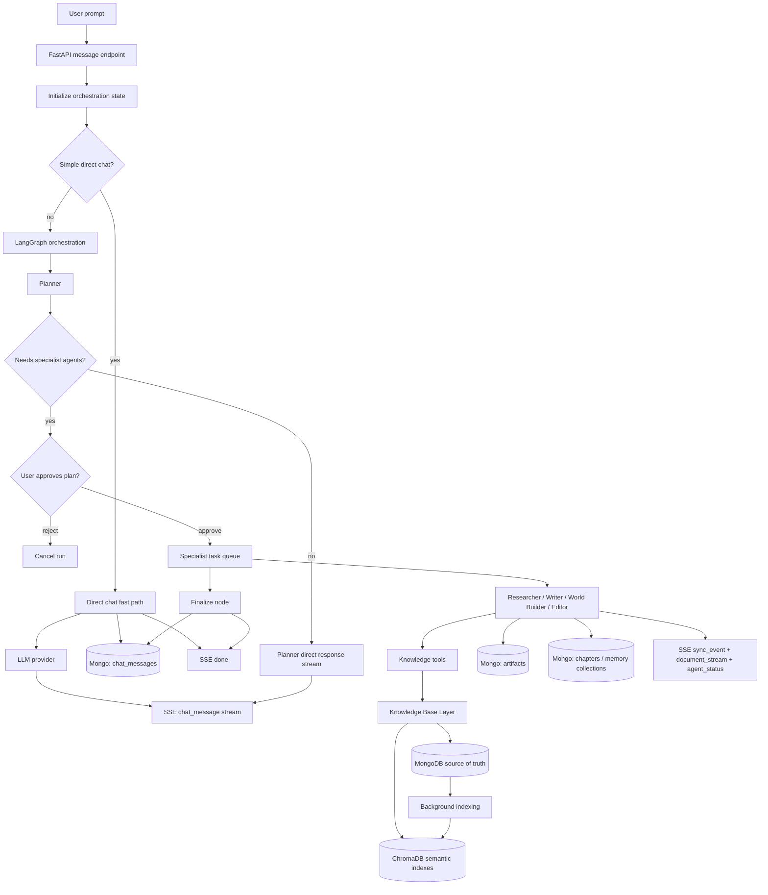
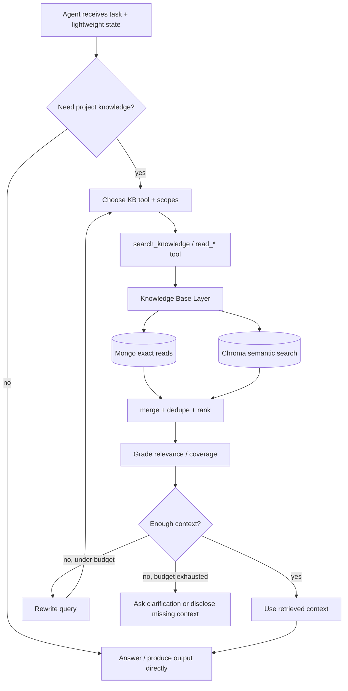
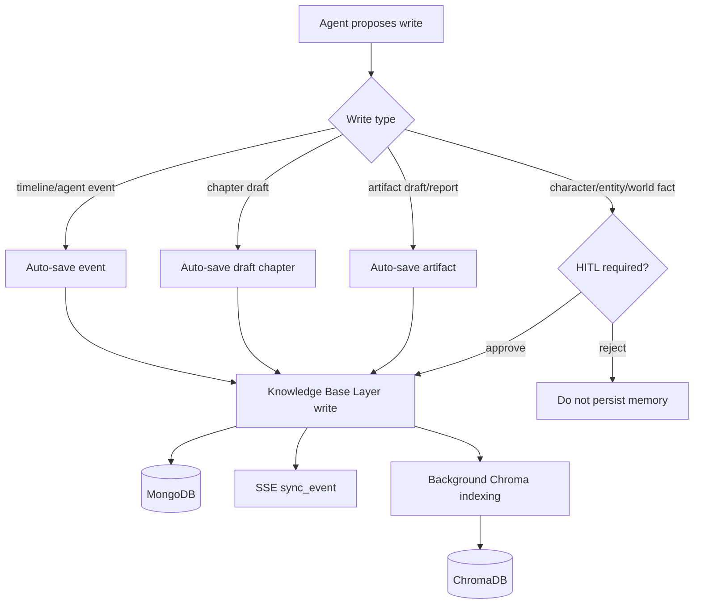
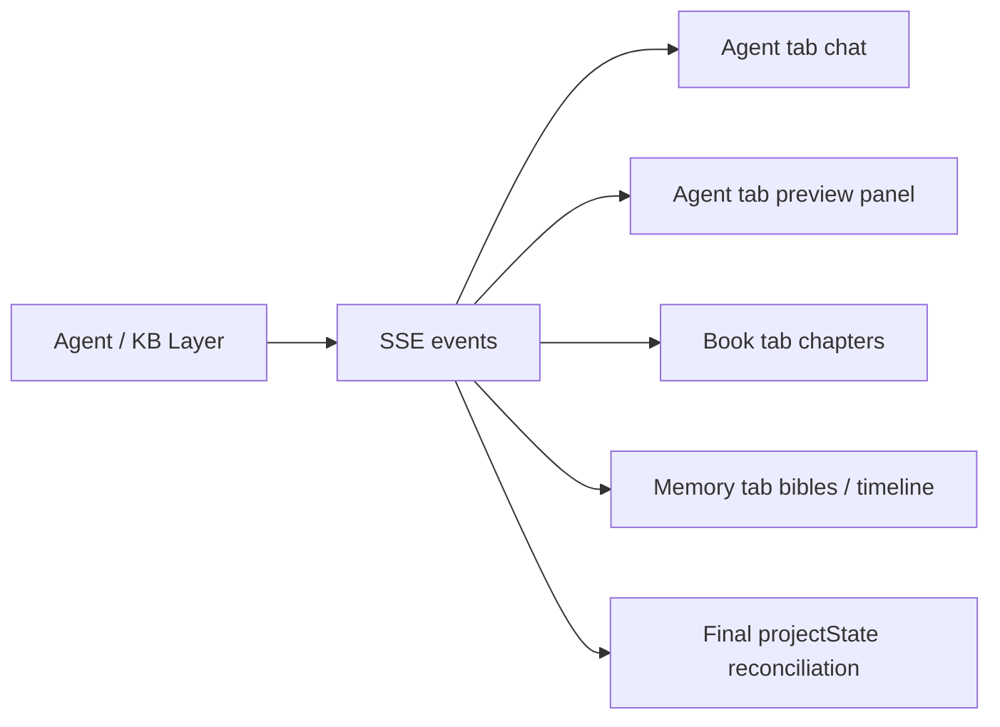

# Bookish Agentic System

This document is the working architecture reference for Bookish agents, knowledge, retrieval, memory, and frontend sync.

The goal is to keep the system agentic without letting agents talk directly to raw storage. Agents should reason and choose tools. The backend should provide safe, business-level knowledge tools that read/write MongoDB and ChromaDB through a dedicated Knowledge Base layer.

---

## 1. Core Decision

Bookish should move toward this architecture:

```text
User -> Agent Orchestration -> Agent -> Knowledge Tools -> Knowledge Base Layer -> MongoDB + ChromaDB
```

Not this:

```text
Agent -> MongoDB
Agent -> ChromaDB
```

The agent should not know raw collection schemas or write directly to databases. It should ask for story knowledge in domain language:

- search narrative context
- read a chapter
- search characters
- search continuity facts
- search style guide
- propose a memory update
- save an approved artifact

The Knowledge Base layer decides whether to use MongoDB exact reads, Chroma semantic search, hybrid retrieval, reranking, or background indexing.

---

## 2. High-Level Flow



---

## 3. Knowledge Store Model

MongoDB remains the source of truth. ChromaDB remains a derived semantic index.

### Target MongoDB Collections

Core project/runtime:

- `projects`
- `project_settings`
- `chat_messages`
- `agent_runs`
- `agent_events`
- `artifacts`
- `retrieval_logs`

Narrative:

- `chapters`
- `chapter_versions`
- `chapter_summaries`
- `scenes`
- `scene_summaries`

Memory/world:

- `characters`
- `character_relationships`
- `entities`
- `locations`
- `organizations`
- `objects`
- `timeline_events`
- `plot_threads`
- `continuity_facts`
- `world_facts`
- `style_guides`
- `user_assets`

### Target ChromaDB Collections

Recommended practical split:

- `narrative`
- `characters`
- `world`
- `timeline`
- `plot`
- `continuity`
- `style`
- `assets`
- `artifacts`

More granular future split if needed:

- `chapter_content`
- `chapter_summaries`
- `scene_content`
- `scene_summaries`
- `character_bible`
- `character_relationships`
- `locations`
- `organizations`
- `objects`
- `world_facts`
- `plot_threads`
- `continuity_facts`
- `timeline_events`
- `style_guides`
- `user_assets`
- `research_notes`
- `agent_artifacts`

---

## 4. Knowledge Base Layer

Create a backend layer that owns all knowledge access:

```text
server/app/knowledge/
  service.py      # public business-level KB API
  tools.py        # agent-facing tool functions
  retrieval.py    # search, rerank, grade, query rewriting
  schemas.py      # typed tool inputs/outputs
  scopes.py       # narrative, characters, world, plot, continuity, style...
  indexing.py     # routing Mongo writes into Chroma indexes
```

The KB layer should expose business tools, not raw storage primitives.

Good:

- `search_knowledge(query, scopes, intent, max_results)`
- `read_chapter(chapter_id | chapter_number)`
- `read_scene(scene_id)`
- `read_character(name | id)`
- `read_world_entity(name | id)`
- `read_plot_threads(status?)`
- `read_continuity_facts(query)`
- `read_style_guide(query)`
- `save_artifact(type, content, metadata)`
- `propose_memory_update(type, payload)`
- `save_approved_memory(type, payload)`

Avoid:

- `mongo_find(collection, query)`
- `mongo_update(collection, payload)`
- `chroma_query(collection, embedding)`

Raw DB tools put schema burden and unsafe write power on the LLM.

---

## 5. Agentic Retrieval Standard

Do not always pre-load all context. That becomes deterministic, slow, and noisy.

Do not let agents retrieve with no boundaries either. That becomes unpredictable.

Use the 2026 production pattern:

```text
lightweight base context
+ LLM-selected retrieval tools
+ retrieval grading
+ query rewrite loop
+ hard budgets
+ retrieval logs
```



Recommended budgets:

- normal agents: max 2 retrieval rounds
- researcher / continuity-heavy editor passes: max 3 retrieval rounds
- max 5 documents per tool call
- minimum relevance threshold per scope
- log every query, result, score, and selected source

---

## 6. Agent Tool Access

Every agent can access the same KB layer, but tool permissions and default scopes differ.

| Agent | Primary Reads | Primary Writes |
|---|---|---|
| Planner | summaries, plot, timeline, continuity, high-level memory | planner decision |
| Researcher | all scopes, assets, artifacts, web/project knowledge | research artifact |
| Writer | narrative, characters, world, plot, continuity, style | draft artifact, draft chapter |
| World Builder | characters, world, locations, organizations, objects, continuity | proposed/approved memory |
| Editor | style, continuity, narrative, plot, chapter, character voice | edited artifact, chapter update, summary |

---

## 7. Prompt Structure

Each agent prompt should follow the same shape:

```text
ROLE
You are the <agent> for Bookish.

TASK
...

LIGHTWEIGHT STATE
- project title
- genre/tone
- current chapter/scene if known
- current handoff from previous agent

AVAILABLE KNOWLEDGE TOOLS
- search_knowledge(query, scopes, intent, max_results)
- read_chapter(...)
- read_scene(...)
- read_character(...)
- read_style_guide(...)
- propose_memory_update(...)

RETRIEVAL POLICY
Before final output, decide whether project knowledge is needed.
If the task depends on existing story facts, continuity, character traits, timeline, world facts, style, or user assets, call the appropriate tool first.
If retrieved context is weak, rewrite the query and retrieve again within budget.
If context is still missing, say what is missing instead of inventing.

OUTPUT CONTRACT
Return either a tool call or final output in the requested schema.
Do not expose internal reasoning to the user.
```

---

## 8. Write Policy and HITL

Writes should go through the Knowledge Base layer. Some writes can be automatic; durable story memory should be reviewed.



Recommended HITL-required writes:

- new character bible entries
- new entity/location/object/organization memory
- major continuity facts
- major plot thread changes
- publishing/finalizing chapters, if user preference requires it

Usually automatic:

- artifacts
- draft chapters
- agent execution events
- retrieval logs
- temporary summaries

---

## 9. Frontend Sync and UX

SSE remains the UI contract.

Public events:

- `chat_message` for assistant chat text
- `document_stream` for long artifact/chapter/research preview
- `agent_status` for lightweight progress metadata
- `user_confirmation` for HITL
- `sync_event` for Mongo-derived UI updates
- `done` for final reconciliation snapshot
- `error` for failures

Frontend should treat Mongo project state as canonical and use SSE for responsiveness.



---

## 10. Observability

Add `retrieval_logs` so missed context can be debugged.

Each retrieval log should store:

- run id
- agent
- task
- tool name
- scopes searched
- query text
- query rewrite round
- returned document ids
- scores
- chosen context ids
- missing context notes
- final answer/artifact id

This lets us answer:

- Did the agent retrieve before writing?
- Which collection did it search?
- Did it find the right character/chapter/fact?
- Did it ignore retrieved context?
- Are chunks/collections too broad?

---

## 11. Known Current Gaps

Current implementation still has these gaps:

- Chroma collections are too broad (`world_system` mixes entities, assets, research, and facts).
- Retrieval tools are too generic (`search_rag`, `read_chapter`) and not business-level enough.
- Agents can skip retrieval unless the prompt/tool loop leads them to it.
- No retrieval grading loop yet.
- No retrieval log collection yet.
- Editor mostly relies on state handoff instead of active style/continuity retrieval.
- Style guide exists as a vector collection, but it is not strongly enforced in writer/editor prompts.
- Mongo `entity_bible` is doing too much; locations, objects, organizations, and world facts should become clearer.

---

## 12. Implementation Order

Recommended order before changing prompts heavily:

1. Add `server/app/knowledge/` layer.
2. Create business-level read tools over existing Mongo/Chroma.
3. Add retrieval logs.
4. Split Chroma scopes first, while keeping Mongo migration minimal.
5. Update agent prompts to use KB tools and retrieval policy.
6. Add retrieval grading and query rewrite loop.
7. Add new Mongo collections where the product needs durable structured memory.
8. Add evaluations/golden prompts for agent memory and continuity.

This keeps the migration incremental and avoids breaking the current agent graph.
