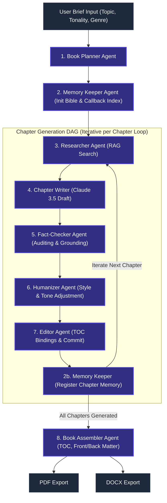
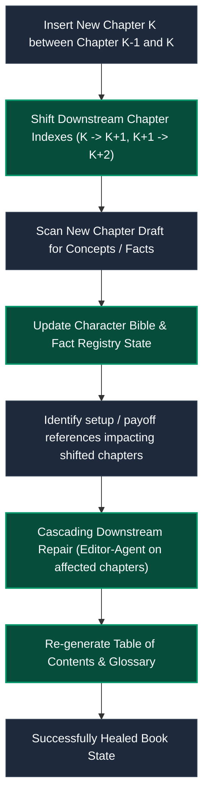

# AIuthor: Complete System Architecture, Agentic Workflow & Migration Spec

Welcome to the master technical specification for **AIuthor** (also referred to as **Bookish**), a stateful, multi-agent publishing platform designed to compile publication-ready books from a single brief. 

This document consolidates product requirements, system architecture, database layouts, multi-agent orchestrations, runtime models, persistent storage schemas, migration history, API contracts, monitoring protocols, and implementation roadmaps into a single unified reference.

---

## 📖 Table of Contents
1. [Core Architectural Philosophy](#1-core-architectural-philosophy)
2. [Master Orchestration Network & Topology](#2-master-orchestration-network--topology)
3. [Transactional Chapter Generation DAG](#3-transactional-chapter-generation-dag)
4. [State Schemas & Type Definitions](#4-state-schemas--type-definitions)
5. [Specialist Agent Profiles & Coordination Contracts](#5-specialist-agent-profiles--coordination-contracts)
6. [Persistent Memory Architecture (Dual-DB Split)](#6-persistent-memory-architecture-dual-db-split)
7. [Setup/Payoff Continuity Callbacks](#7-setuppayoff-continuity-callbacks)
8. [Downstream Self-Healing Shift Pipeline (TOC Shifts)](#8-downstream-self-healing-shift-pipeline-toc-shifts)
9. [RAG Pipeline & Fact Grounding Audit](#9-rag-pipeline--fact-grounding-audit)
10. [Observability, Cost Ledgers & Automated Evaluations](#10-observability-cost-ledgers--automated-evaluations)
11. [Production Codebase Layout & API Contracts](#11-production-codebase-layout--api-contracts)
12. [Migration & Implementation Summary](#12-migration--implementation-summary)
13. [Testing, Monitoring & Troubleshooting](#13-testing-monitoring--troubleshooting)
14. [Master Implementation Roadmap Checklist](#14-master-implementation-roadmap-checklist)

---

## 1. Core Architectural Philosophy

Demonstration scripts fail under the weight of long-form generation. AIuthor rejects unbounded emergent autonomy and fragile monolithic prompt loops (like basic ReAct chains). Instead, it implements a highly structured, stateful runtime combining **deterministic graph control flows** (using LangGraph), **hierarchical multi-agent delegation**, **split-database memory systems**, and **continuous self-evaluation**.

```
+---------------------------------------------------------------------------------+
|                                 USER REQUEST                                    |
+---------------------------------------------------------------------------------+
                                         |
                                         v
+---------------------------------------------------------------------------------+
|                       PERCEPTION: Input Parsing & Router                        |
+---------------------------------------------------------------------------------+
                                         |
                                         v
   +---------------------------------------------------------------------------+
   | COGNITIVE LOOP                                                            |
   |                                                                           |
   |   +-------------------------------------------------------------------+   |
   |   | PLANNING: Reasoning Model / MCTS                                  | <+
   |   +-------------------------------------------------------------------+  |
   |                                     |                                    |
   |                                     v (Formulate Plan)                   |
   |   +-------------------------------------------------------------------+  |
   |   | REFLECTION: Critic & Self-Evaluation                              |  |
   |   +-------------------------------------------------------------------+  |
   |                                     |                                    |
   |                                     v (Refine Plan)                      |
   |   +-------------------------------------------------------------------+  |
   |   | ACTION: Microkernel Dispatcher                                    |  |
   |   +-------------------------------------------------------------------+  |
   |                                     |                                    |
   |                                     v (Execute Tools)                    |
   |   +-------------------------------------------------------------------+  |
   |   | TOOLS & MCP SERVERS                                               |  |
   |   +-------------------------------------------------------------------+  |
   |                                     |                                    |
   |                                     v (Observe Outcomes)                 |
   |   +-------------------------------------------------------------------+  |
   |   | MEMORY SYSTEM: Semantic & Episodic Memory                         | -+
   |   +-------------------------------------------------------------------+   |
   +---------------------------------------------------------------------------+
                                         |
                                         v
+---------------------------------------------------------------------------------+
|                             FINAL UNIFIED RESPONSE                              |
+---------------------------------------------------------------------------------+
```

### Core Primitives
* **The LLM as CPU**: The language model behaves as a cognitive kernel executing instruction streams and parsing structures.
* **Perception-Reasoning-Action (PRA) Loop**: Standardized step iterations that parse incoming stimuli, decide actions, and execute state mutations.
* **Structured Orchestration > Emergent Autonomy**: Every state transition is bound by strict Pydantic schemas, SQLite checkpoint registers, and LLM-as-a-judge guardrails.

> [!IMPORTANT]
> **Active Memory Protocol**
> A flat vector database is not a complete memory system. AIuthor separates memory into distinct functional zones (Working, Episodic, Semantic, and Procedural) and applies continuous compaction and pruning to prevent context window bloat and token poisoning.

---

## 2. Master Orchestration Network & Topology

The system uses a **Stateful Orchestrator-Worker & DAG hybrid** architecture. A centralized graph state coordinates tasks across two persistent state-management nodes and a transactional **Chapter Generation DAG**.



### The Web API Gateway Router
Every incoming request hits the Web API layer.
1. **Direct Q&A Path (`general_chat`)**: If the prompt queries current state (e.g., *"Show the outline"* or *"Who is character X?"*), the orchestrator intercepts the request, runs database queries, and returns a response via the `finalize` node without running the Specialist DAG.
2. **Agent Task Path (`agent_task`)**: If the user requests content generations, editing, or updates, the orchestrator initializes orchestration state, sets up dynamic task trackers, and dispatches execution to the **Book Planner**.

---

## 3. Transactional Chapter Generation DAG

Once the Book Planner structures an action plan, the **Chapter Generation DAG** processes the targeted chapter sequentially.

```
[ USER INPUT: "Draft Chapter 5" ]
  |
  v
+--------------------------+
|  A. RESEARCHER (RAG)     |  --> Queries Vector Store for domain-specific facts
|                          |  --> Pulls 5 high-density context documents & active memories
+--------------------------+
  |
  v
+--------------------------+
|  B. CHAPTER WRITER       |  --> Receives RAG context + Character Bible definitions
|                          |  --> Generates initial markdown draft matching outline targets
+--------------------------+
  |
  v
+--------------------------+
|  C. FACT-CHECKER         |  --> Compares generated assertions against grounding indices
|                          |  --> Strips/softens ungrounded claims (Citation-or-Soften Rule)
+--------------------------+
  |
  v
+--------------------------+
|  D. HUMANIZER            |  --> Scans for and strips AI tells ("delve", "fast-paced world")
|                          |  --> Metrics filter: adjusts sentence lengths and domestic analogies
+--------------------------+
  |
  v
+--------------------------+
|  E. EDITOR               |  --> Final syntax review, updates dynamic word-count indices
|                          |  --> Flags state as "completed" and commits content
+--------------------------+
```

---

## 4. State Schemas & Type Definitions

To enforce structured, deterministic outputs without relying on fragile regex parsers, all agent nodes communicate through strongly typed **Pydantic schemas** and a runtime **LangGraph State schema**.

### A. Outline & Document Schema (Pydantic Models)

```python
from pydantic import BaseModel, Field
from typing import List, Dict, Optional, Literal

class ChapterOutline(BaseModel):
    chapter_number: int
    title: str
    target_word_count: int
    focus_areas: List[str]
    required_facts: List[str]
    character_arcs: Optional[List[str]] = None

class BookOutline(BaseModel):
    title: str
    subtitle: Optional[str] = None
    target_tonality: Literal["Conversational", "Academic", "Storyteller", "Motivational", "Witty"]
    front_matter_plan: List[str]
    chapters: List[ChapterOutline]
    back_matter_plan: List[str]

class MemoryState(BaseModel):
    fact_registry: Dict[str, Dict] = Field(default_factory=dict)
    character_bible: Dict[str, Dict] = Field(default_factory=dict)
    callback_index: List[Dict] = Field(default_factory=list)
    tonality_fingerprint: Dict[str, float] = Field(default_factory=dict)
    decision_log: List[Dict] = Field(default_factory=list)

class AgenticBookState(BaseModel):
    brief: Dict[str, str]
    outline: Optional[BookOutline] = None
    memory: MemoryState = Field(default_factory=MemoryState)
    chapters_content: Dict[int, str] = Field(default_factory=dict)
    current_chapter_index: int = 0
    observability_traces: List[Dict] = Field(default_factory=list)
```

### B. Runtime Execution State Schema (TypedDicts)
This state dictionary (`AgentOrchestrationState`) flows continuously through the compiled LangGraph execution loops.

```python
from typing import TypedDict, List, Dict, Optional, Literal
from datetime import datetime

class TaskStatus(TypedDict):
    agent: Literal["planner", "researcher", "fact_checker", "writer", "humanizer", "editor"]
    task: str
    status: Literal["pending", "running", "completed", "failed"]
    startedAt: Optional[datetime]
    completedAt: Optional[datetime]
    outputArtifactId: Optional[str]
    error: Optional[str]

class PlannerOutput(TypedDict):
    intent: str
    decision: str
    agentsNeeded: List[str]
    tasks: List[Dict[str, any]]
    memoryUpdates: List[str]
    userVisibleSummary: str

class ProjectContext(TypedDict):
    projectId: str
    title: str
    genre: str
    tonality: str
    characterCount: int
    chapterCount: int
    recentMemories: List[str]

class AgentOrchestrationState(TypedDict):
    projectId: str
    userMessageId: str
    userPrompt: str
    route: Literal["general_chat", "agent_task"]
    projectContext: ProjectContext
    plannerOutput: Optional[PlannerOutput]
    tasks: List[TaskStatus]
    currentTaskIndex: int
    researchNotes: Optional[str]
    factCheckReport: Optional[str]
    draftContent: Optional[str]
    humanizedContent: Optional[str]
    editedContent: Optional[str]
    artifactIds: List[str]
    finalResponse: str
    finalMessageId: Optional[str]
    agentRunId: str
    status: Literal["pending", "running", "completed", "failed"]
    startedAt: datetime
    completedAt: Optional[datetime]
    error: Optional[str]
```

### C. State Update Node Implementation Pattern

Each active LangGraph node fetches the shared state, updates the running status, executes its specific LLM generation or storage routine, saves the resulting artifact to MongoDB and indexes it in ChromaDB, and passes the updated state dict forward.

```python
def writer_node(state: AgentOrchestrationState) -> AgentOrchestrationState:
    task_idx = state["currentTaskIndex"]
    state["tasks"][task_idx]["status"] = "running"
    state["tasks"][task_idx]["startedAt"] = datetime.now()
    
    draft = generate_draft(
        prompt=state["tasks"][task_idx]["task"],
        context=state["projectContext"],
        research=state.get("researchNotes")
    )
    
    artifact_id = save_artifact(
        projectId=state["projectId"],
        agentRunId=state["agentRunId"],
        agentName="writer",
        content=draft
    )
    
    state["draftContent"] = draft
    state["artifactIds"].append(artifact_id)
    state["tasks"][task_idx]["status"] = "completed"
    state["tasks"][task_idx]["completedAt"] = datetime.now()
    state["tasks"][task_idx]["outputArtifactId"] = artifact_id
    state["currentTaskIndex"] += 1
    
    return state
```

---

## 5. Specialist Agent Profiles & Coordination Contracts

Each specialist agent operates with a sandboxed context and a clean output contract. They do not cross over responsibilities.

| Agent Name | Operational Focus | Primary Inputs | Output Contract | Key Failure Path Mitigation |
| :--- | :--- | :--- | :--- | :--- |
| **Planner** | Task parsing & DAG routing | User brief, project context, memories | `PlannerOutput` structured schema | If intent is ambiguous, falls back to direct conversation mode. |
| **Researcher** | RAG search & semantic retrieval | Target requirements, concept lists | Detailed research notes, fact outlines | If ChromaDB returns low-similarity matches, triggers Tavily fallback search. |
| **Writer** | Draft prose synthesis | Pydantic outline, RAG notes, bible profiles | Draft markdown prose | Context compression algorithm aggregates summaries if token limits are approached. |
| **Fact-Checker** | Factual audits & citation checking | Draft prose, sparse source references | Audit verification report | **Abstention Flag**: Softens/strips any assertion lacking dense similarity grounding in the DB. |
| **Humanizer** | Styling, pacing, and dynamic tonality | Raw draft, style guides, forbidden lists | Humanized markdown prose | Runs regex token analyzer to intercept "AI Tells" and enforces varied sentence rhythms. |
| **Editor** | TOC structural bindings & proofing | Humanized prose, outlining structures | Completed chapter draft, word count | Schema checkers verify markdown formatting integrity before committing content. |
| **Memory Keeper** | Entity sync & continuity audits | Completed chapters, dynamic decision states | SQLite / DB update instructions | Re-evaluates target callback indices when shifts are dispatched. |
| **Assembler** | Front/Back matter & final compilation | Consolidated chapters, formatting rules | Publication-ready PDF & DOCX bundles | Automatically builds and formats table of contents, glossary definitions, and indexes. |

---

## 6. Persistent Memory Architecture (Dual-DB Split)

To ensure high-throughput execution speeds and robust transactions across multi-chapter projects, memory is split between a transactional SQL/NoSQL store (**MongoDB**) and a high-performance vector store (**ChromaDB**).

```
                        +---------------------------------------------+
                        |         INCOMING CONTEXT / EVENT STREAM     |
                        +---------------------------------------------+
                                               |
                                               v
                        +---------------------------------------------+
                        |           MEMORY KEEPER ORCHESTRATOR        |
                        +---------------------------------------------+
                                       /                 \
                      (Transactional / State)       (Semantic Embeddings)
                                     /                     \
                                    v                       v
            +------------------------------+       +------------------------------+
            |      MONGODB DOCUMENT STORE  |       |      CHROMADB VECTOR DB      |
            +------------------------------+       +------------------------------+
            |                              |       |                              |
            |  * EPISODIC MEMORY           |       |  * SEMANTIC MEMORY           |
            |    - User/Agent Chat Logs    |       |    - RAG Reference Docs      |
            |    - Checkpoint States       |       |    - Grounding Facts         |
            |    - Decision Logs (Traces)  |       |    - Extracted Snippets      |
            |                              |       |                              |
            |  * PROCEDURAL MEMORY         |       |  * VECTOR SPACE INDICES      |
            |    - Book TOC Outlines       |       |    - Text Embeddings         |
            |    - Callback Setup Targets  |       |    - Cosine Similarity       |
            |                              |       |                              |
            |  * ENTITY BIBLE              |       |  * KEY RELATIONSHIPS         |
            |    - Character profiles      |       |    - MongoDB Document Ref IDs|
            |    - Concept sheets          |       |      (mapped as metadata)    |
            |                              |       |                              |
            +------------------------------+       +------------------------------+
                                   \                       /
                                    \                     /
                                     v                   v
                        +---------------------------------------------+
                        |        HYBRID REASONING CONTEXT GENERATOR   |
                        +---------------------------------------------+
                                               | (Context-injected prompt)
                                               v
                                     [ CHAPTER WRITER LLM ]
```

### A. MongoDB Schema Specifications

#### 1. Collection: `projects`
Stores workspace metadata and global LLM model configuration settings.
```json
{
  "_id": "ObjectId",
  "title": "string",
  "subtitle": "string",
  "genre": "string",
  "tonality": "string",
  "createdAt": "ISODate",
  "settings": {
    "plannerModel": { "provider": "string", "modelName": "string" },
    "writerModel": { "provider": "string", "modelName": "string" },
    "factCheckerModel": { "provider": "string", "modelName": "string" },
    "humanizerModel": { "provider": "string", "modelName": "string" }
  }
}
```
*Index*: `createdAt` (descending).

#### 2. Collection: `chapters`
Maintains TOC order, word counts, and completion statuses.
```json
{
  "_id": "ObjectId",
  "projectId": "ObjectId",
  "chapterNumber": "number",
  "title": "string",
  "content": "string",
  "outline": "string",
  "status": "planned | drafted | edited | finalized",
  "wordCount": "number",
  "version": "number",
  "createdBy": "user | agent",
  "agentRunId": "ObjectId",
  "createdAt": "ISODate",
  "updatedAt": "ISODate",
  "chromaId": "string"
}
```
*Index*: Compound index on `(projectId, chapterNumber)` (unique).

#### 3. Collection: `characters` (Bible)
Stores dynamic character profiles and core conceptual details.
```json
{
  "_id": "ObjectId",
  "projectId": "ObjectId",
  "name": "string",
  "type": "protagonist | antagonist | supporting | minor",
  "bible": {
    "physical_description": "string",
    "personality": "string",
    "background": "string",
    "arc": "string",
    "voice_notes": "string"
  },
  "aliases": ["string"],
  "firstAppearance": "string",
  "createdAt": "ISODate",
  "updatedAt": "ISODate",
  "chromaId": "string"
}
```
*Index*: `projectId` (ascending), `name` (text search).

#### 4. Collection: `chat_messages`
A single chat session is persisted per project, eliminating session/chatId sprawl.
```json
{
  "_id": "ObjectId",
  "projectId": "ObjectId",
  "role": "user | assistant | system",
  "content": "string",
  "agentRunId": "ObjectId (optional)",
  "artifactReferences": ["ObjectId"],
  "createdAt": "ISODate"
}
```
*Index*: `projectId` (ascending), `createdAt` (ascending).

#### 5. Collection: `agent_runs`
Maintains complete workflow execution history and dynamic tracking logs.
```json
{
  "_id": "ObjectId",
  "projectId": "ObjectId",
  "userMessageId": "ObjectId",
  "route": "general_chat | agent_task",
  "userPrompt": "string",
  "plannerDecision": {
    "intent": "string",
    "decision": "string",
    "agentsNeeded": ["string"],
    "tasks": [{ "agent": "string", "task": "string", "order": "number" }],
    "memoryUpdates": ["string"],
    "userVisibleSummary": "string"
  },
  "agentExecutions": [
    {
      "agent": "researcher | fact_checker | writer | humanizer | editor",
      "taskInput": "string",
      "status": "pending | running | completed | failed",
      "startedAt": "ISODate",
      "completedAt": "ISODate",
      "outputArtifactId": "ObjectId"
    }
  ],
  "status": "pending | running | completed | failed",
  "startedAt": "ISODate",
  "completedAt": "ISODate"
}
```
*Index*: Compound index on `(projectId, startedAt)` (descending).

#### 6. Collection: `artifacts`
Houses outputs generated by individual specialist nodes.
```json
{
  "_id": "ObjectId",
  "projectId": "ObjectId",
  "agentRunId": "ObjectId",
  "agentName": "researcher | fact_checker | writer | humanizer | editor",
  "artifactType": "research_notes | fact_check_report | draft | edited_content | humanized_content",
  "content": "string",
  "metadata": { "wordCount": "number", "assumptions": "string", "changes": "string" },
  "relatedChapterId": "ObjectId",
  "createdAt": "ISODate"
}
```
*Index*: Compound index on `(projectId, agentName)`, and `agentRunId` (ascending).

#### 7. Collection: `project_memory`
Dynamic memory slots containing style matrices, global rules, and preferences.
```json
{
  "_id": "ObjectId",
  "projectId": "ObjectId",
  "memoryType": "decision | constraint | preference | world_rule | style_guide",
  "content": "string",
  "source": "user | planner | agent",
  "importance": "high | medium | low",
  "createdAt": "ISODate",
  "lastAccessedAt": "ISODate",
  "chromaId": "string"
}
```
*Index*: Compound index on `(projectId, importance)`.

---

### B. ChromaDB Collection Specifications

To simplify vector routing, all semantic metadata is indexed within a unified collection: `bookish_semantic_index` utilizing type-based metadata partitioning.

#### 1. Semantic Memory Store (Metadata Layout)
```json
{
  "id": "char_sarah_01",
  "document": "Physical: Chestnut hair, risk-averse junior investment analyst. Arc: Transitions from fearful budgeting to bold investments.",
  "metadata": {
    "type": "character_bible",
    "projectId": "proj_123",
    "characterName": "Sarah",
    "characterType": "protagonist"
  }
}
```

#### 2. Grounding Store (Metadata Layout)
```json
{
  "id": "fact_comp_interest",
  "document": "Assertion: Compound interest represents the addition of interest to the principal sum of a loan or deposit.",
  "metadata": {
    "type": "agent_artifact",
    "projectId": "proj_123",
    "agentName": "fact_checker",
    "artifactType": "fact_check_report",
    "timestamp": "2026-05-23T20:45:00Z"
  }
}
```

---

## 7. Setup/Payoff Continuity Callbacks

To maintain cohesive character arcs and running themes across massive text outputs (25,000+ words), the **Memory Keeper** orchestrates narrative setups and payoffs.

### Continuity Interception Flow
```
         [Callback Index Log]
         +-----------------------------------------------------+
         | Setup: Ch 1 (Sarah's Notebook ledger discrepancy)   |
         | Target Payoff: Ch 6 (Marcus confronts Sarah)        |
         | Status: Pending (○)                                 |
         +-----------------------------------------------------+
                                    |
                                    v (User triggers Ch 6 Draft)
+---------------------------------------------------------------------------------+
| ORCHESTRATOR COGNITIVE INTERCEPTOR                                              |
+---------------------------------------------------------------------------------+
  |
  +--- [Step A] Pulls Setup Context ("Sarah's Notebook")
  |
  +--- [Step B] Injects into Researcher (RAG) stream alongside standard vectors
  |
  +--- [Step C] Chapter Writer generates confrontation text referencing notebook
  |
  +--- [Step D] Editor verifies payoff is included, updates Callback status to Resolved (✓)
```

1. **Registration**: When the Planner or Writer establishes a motif setup (e.g., Chapter 1: *"Sarah buys a green velvet notebook"*), the Memory Keeper registers a record in `callback_index` targeting Chapter 6 for payoff.
2. **Cognitive Interception**: When Chapter 6 is triggered, the system scans for pending payoffs targeting Chapter 6.
3. **RAG Injection**: The "green velvet notebook" context is injected directly into Chapter 6's RAG prompt, ensuring the Writer utilizes it.
4. **Validation Pass**: The Editor verifies reference inclusion and flags the index item as `resolved = true` (✓).

---

## 8. Downstream Self-Healing Shift Pipeline (TOC Shifts)

When a user introduces a new chapter in the middle of a completed outline sequence (e.g., inserting a new Chapter 5 into a 10-chapter book), the **Memory Keeper** triggers a self-healing pipeline to prevent continuity collapse.



### Shift Progression Logic
1. **Index Shifts (`+1`)**: Shift all downstream chapter indices by `+1` (Chapter 5 becomes 6, 6 becomes 7) inside a transactional atomic MongoDB block.
2. **Callback Coordinate Repair**: Scan the `callback_index` collection. If a setup payoff target was scheduled for Chapter 6, update its target destination to Chapter 7.
3. **Concept Bible Realignment**: Shift chapter references in `character_bible` active chapter array listings.
4. **TOC Re-compilation**: Re-execute the Assembler's Table of Contents compiler and dynamic Glossary page layouts.

---

## 9. RAG Pipeline & Fact Grounding Audit

For non-fiction and fact-critical genres, AIuthor strictly controls hallucinations.

```
[ Incoming Source Docs ] ➔ Semantic Chunking (150-250 tokens)
                                 │
                                 v
                     [ Dense + Sparse Indexing ]
                    /                           \
         Dense (text-embedding-3-small)      Sparse (BM25 ranking)
                    \                           /
                     v                         v
               [ Cosine Similarity Similarity Ranking ]
                                 │
                                 v
                  [ Cross-Encoder / Reranker (Top k=5) ]
                                 │
                                 v
                 [ Context-Injected Generation Prompt ]
```

### Fact Auditor Verification Rules
* **Strict Grounding Contract**: The Writer is explicitly locked down to retrieved chunks. Ungrounded assertions are stripped.
* **Citation-or-Soften Rule**: If a fact cannot be audited by the Fact-Checker, it is softened (e.g., *"Historical models indicate..."* rather than *"On March 14, 1924, Vanguard published..."*) or stripped entirely.

---

## 10. Observability, Cost Ledgers & Automated Evaluations

### A. Trace Ledger Structure (JSON Metadata)
Every generation compiles an append-only JSON trace tracking performance, cost, and alignment.
```json
{
  "run_id": "run_987654321",
  "projectId": "proj-3d7e006f",
  "cost_ledger": {
    "total_input_tokens": 124500,
    "total_output_tokens": 45600,
    "total_cost_usd": 1.45,
    "model_distribution": {
      "gpt-4o": 0.95,
      "claude-3-5-sonnet": 0.40,
      "gpt-4o-mini": 0.10
    }
  },
  "agent_traces": [
    {
      "node": "Humanizer",
      "timestamp": "2026-05-23T20:46:12Z",
      "checks_passed": {
        "no_ai_tells": true,
        "avg_sentence_variation_std_dev": 8.2
      }
    }
  ]
}
```

### B. Automated Evaluation Rubric (LLM-as-a-Judge)

Before a compilation is declared "Publication-Ready", it must satisfy the following automated criteria:

| Metric | Target | Evaluation Logic | Failure Correction |
| :--- | :--- | :--- | :--- |
| **Structural Integrity** | 100% | Check presence of Preface, Dedication, Chapters, Glossary, Index. | Returns block to Assembler. |
| **Tonality Fidelity** | <0.15 distance | Cosine similarity of target styling embeddings vs. reference style exemplars. | Routes chapter back to Humanizer. |
| **Humanization Grade** | Zero Tells | Scanner detects forbidden phrases (`"delve"`, `"testament"`, `"not only...but also"`). | Triggers edit cycle in Humanizer. |
| **Factual Grounding** | 100% | Fact-Checker maps output assertions back to indexed source document reference IDs. | Softens or strips ungrounded facts. |
| **Callback Resolution** | 100% | Ensures setup motifs find matching completed payoffs in downstream files. | Injects payoff back into RAG query. |

---

## 11. Production Codebase Layout & API Contracts

To handle asynchronous executions cleanly, the backend separates the FastAPI web gateway from the LangGraph execution loop.

### A. Production File Structure
```text
bookish/
│
├── .env                       # Environment credentials
├── Agentic_Workflow.md        # [THIS FILE] Unified Master Spec
├── requirements.txt           # Python dependencies
├── main.py                    # Gateway app setup & route bindings
│
├── server/                    # Backend Source Files
│   ├── main.py                # Backend Entrypoint
│   │
│   ├── config.py              # Pydantic BaseSettings config
│   │
│   ├── api/                   # Web Layer (FastAPI)
│   │   ├── dependencies.py    # MongoDB & Chroma Client injectors
│   │   └── v1/
│   │       ├── books.py       # Endpoints: POST /books (Trigger), GET /books/{id}/status
│   │       └── chapters.py    # Chapter lookups & manual edit overrides
│   │
│   ├── db/                    # Storage Layer
│   │   ├── mongo_client.py    # MongoDB transactional connections
│   │   └── chroma_client.py   # ChromaDB vector engines
│   │
│   ├── schemas/               # Typed Models
│   │   ├── book.py            # Pydantic brief schemas
│   │   └── agent_state.py     # Runtime state validator schemas
│   │
│   ├── repository/            # DB Repository Connectors
│   │   ├── chat_messages.py   # Persistent Chat Message repository (Single chat per project)
│   │   ├── messages.py        # Message GET & POST database repository [NEW]
│   │   ├── agent_runs.py      # Planner decision & Agent exec history tracking
│   │   ├── artifacts.py       # Specialist outputs repository
│   │   └── project_memory.py  # Long-term context & decision slots
│   │
│   ├── routers/               # Route endpoints
│   │   ├── projects.py        # Project CRUD routes
│   │   ├── messages.py        # Chat message GET & POST routes [NEW]
│   │   └── settings.py        # Global settings configuration routes
│   │
│   └── agents/                # AI Runtimes
│       ├── orchestration_state.py # LangGraph State schemas
│       ├── orchestrator.py    # Classification & direct response dispatcher
│       ├── orchestration_graph.py # Master Compiled StateGraph configuration
│       │
│       ├── nodes/             # Specialist operational steps
│       │   ├── planner_node.py
│       │   ├── researcher_node.py
│       │   ├── writer_node.py
│       │   ├── fact_checker_node.py
│       │   ├── humanizer_node.py
│       │   └── editor_node.py
│       │
│       └── utils.py           # Reusable LLM helper utilities
```

### B. Core API Endpoint Contract

#### 1. Submit Chat Message
**POST** `/api/projects/{id}/message`

Receives user text, runs orchestrator routing classification, executes the multi-agent graph run, and returns response metadata. Supports `message` (and `prompt` as fallback) payloads.

#### Request JSON
```json
{
  "message": "Write chapter 3 about the castle siege"
}
```

#### Response JSON
```json
{
  "reply": "Here is chapter 3: The Siege of Blackwood Castle...\n[Draft Complete]",
  "thinking": "[Orchestrator] Classified as agent_task\n[Planner] Task: Research Castle Sieges, Write Ch 3\n[Researcher] Completed research_notes artifact\n[Writer] Drafted Ch 3 utilizing research_notes...",
  "cost": 0.145,
  "tokens": 4820,
  "projectState": {
    "id": "proj-3d7e006f"
  }
}
```

#### 2. Fetch Chat History
**GET** `/api/projects/{id}/messages`

Returns a list of all saved chat messages (user and assistant) associated with the project, sorted chronologically.

### C. Non-Blocking Background Processing Flow
Because book generation takes time (5 to 30 minutes), endpoints never block.
1. `POST /books` accepts `BookCreate` parameters.
2. Injects a task into MongoDB with a `status: "processing"` property.
3. Launches the LangGraph task asynchronously using FastAPI `BackgroundTasks` (or Celery queue threads).
4. Instantly returns `202 Accepted` alongside the `book_id`.
5. Frontend clients poll `GET /books/{id}/status` to track progress and stream output traces.

```
[User Request] ➔ FastAPI Endpoint (POST /books)
                      │
                      ├──> 1. Creates Initial Book Record in MongoDB (Status: Pending)
                      ├──> 2. Returns 202 Accepted (Book ID) back to User
                      │
                      └──> 3. Triggers Asynchronous Background Thread
                                 │
                            [ LangGraph Engine (graph.py) ]
                                 │
                                 ├──> Node: researcher.py ➔ Pulls web data & saves to ChromaDB
                                 ├──> Node: outliner.py   ➔ Creates outline, saves JSON to MongoDB
                                 ├──> Node: writer.py     ➔ Queries ChromaDB for notes, writes text
                                 └──> Node: reviewer.py   ➔ Approves or routes back to writer
                                 │
                      [ Final Complete Book JSON written to MongoDB (Status: Completed) ]
```

---

## 12. Migration & Implementation Summary

### A. What Was Migrated & Cleaned Up ✅
The project completed a major codebase refactoring to streamline the execution runtime and eliminate legacy/bloated multi-agent setups.
1. **Removed Old Graph Logic**: 
   - ❌ Deleted `agents/graph.py` and `agents/state.py`.
   - ❌ Cleared out the legacy `agents/nodes/` files (original `planner.py`, `researcher.py`, `writer.py`, `fact_checker.py`, `humanizer.py`, `editor.py`, `self_healer.py`).
2. **Simplified Database Relationships**:
   - ❌ **Removed `chatId` completely** from all collections. A single chat session matches a single project.
   - ❌ Stripped out voice, POV, tense, and status definitions from `projects` to ensure a minimal, highly performant schema footprint.
   - ❌ Restricted `user_assets` strictly to Markdown, Plain Text, and Prompt templates.
3. **Implemented Modern Stateful Engine**:
   - ✅ Introduced Pydantic models for book context structure (`ChapterOutline`, `BookOutline`).
   - ✅ Built dynamic repository APIs to cleanly bind collections (`chat_messages`, `agent_runs`, `artifacts`, `project_memory`).
   - ✅ Restructured `routers/projects.py` and consolidated `main.py`.

### B. Implementation Status & Next Steps (TODOs)

* **Orchestration Core**: ✅ Fully Implemented and Compiled.
* **Database & Repositories**: ✅ Completed.
* **Nodes Status**:
  - `planner_node.py` — ✅ Implemented.
  - `researcher_node.py` — ✅ Implemented.
  - `writer_node.py` — ✅ Implemented.
  - `fact_checker_node.py` — ✅ Implemented.
  - `humanizer_node.py` — ✅ Implemented.
  - `editor_node.py` — ✅ Implemented.

---

## 13. Testing, Monitoring & Troubleshooting

### A. Testing API Commands (CURL Executions)

Use these manual command triggers to evaluate routing and task generation operations:

```bash
# 1. Trigger Direct Q&A route execution
curl -X POST http://localhost:8000/api/projects/project_123/prompt \
  -H "Content-Type: application/json" \
  -d '{"prompt": "What is the book title?"}'

# 2. Trigger Specialist Agent Plan DAG route execution
curl -X POST http://localhost:8000/api/projects/project_123/prompt \
  -H "Content-Type: application/json" \
  -d '{"prompt": "Write chapter 3 detailing the battle of Vanguard Hills"}'
```

### B. Database Audit Monitoring Scripts
Quick diagnostic hooks to check execution health directly in the database:

```python
from db.mongo import get_db

db = get_db()
proj_id = "project_123"

# 1. Audit chat log message list size
chat_count = db.chat_messages.count_documents({"projectId": proj_id})
print(f"[Audit] Chat message logs: {chat_count}")

# 2. Trace Planner choices and execution statuses
runs = list(db.agent_runs.find({"projectId": proj_id}))
for run in runs:
    print(f"[Run ID: {run['_id']}] Route: {run['route']}, Status: {run['status']}")
    print(f"  └─ Intent: {run['plannerDecision']['intent']}")
    print(f"  └─ Agents Assigned: {run['plannerDecision']['agentsNeeded']}")

# 3. Retrieve output artifacts
artifacts = list(db.artifacts.find({"projectId": proj_id, "agentName": "writer"}))
for art in artifacts:
    print(f"[Artifact ID: {art['_id']}] Type: {art['artifactType']}, Words: {art['metadata'].get('wordCount')}")
```

### C. Common Troubleshooting Scenarios

#### 1. Issue: Planner classifies a complex task as `general_chat`
* **Root Cause**: The orchestrator's keyword matching or classification prompts in `orchestrator.py` are too strict.
* **Resolution**: Extend the keyword checks or adjust the classification model temperature. Ensure prompts containing action verbs like *"write"*, *"draft"*, *"outline"*, *"rewrite"*, and *"critique"* trigger `agent_task`.

#### 2. Issue: Specialist node fails to pull relevant RAG documents from ChromaDB
* **Root Cause**: Low similarity thresholds or mismatched project metadata tags in the vector collection search parameters.
* **Resolution**: Verify that the document metadata `projectId` matches the running state and lower the distance score limit dynamically if queries return 0 records.

#### 3. Issue: Database transactions fail during dynamic chapter insertions
* **Root Cause**: Index shifting updates are not executing within a unified transaction block, leading to duplicate key constraints on `(projectId, chapterNumber)`.
* **Resolution**: Enforce MongoDB Session Transactions (`with client.start_session() as session:`) to ensure shifting is fully committed or safely rolled back atomically.

---

## 14. Master Implementation Roadmap Checklist

Track overall setup status across platform boundaries:

- [x] **Migration & Code Cleanup**
  - [x] Clear legacy agent nodes and old orchestration graph models.
  - [x] Deprecate database properties and eliminate redundant `chatId` mappings.
- [ ] **Infrastructure & Persistence Layer Setup**
  - [x] Construct MongoDB collection repositories with explicit indexes.
  - [x] Build semantic document indexer methods on ChromaDB.
  - [ ] Complete local or remote embedding vector helper methods.
- [x] **Orchestration Runtimes & Specialized Nodes**
  - [x] Define state data model TypedDict schemas.
  - [x] Build isolated `planner_node`, `researcher_node`, and `writer_node`.
  - [x] Implement `fact_checker_node` citation audit tools.
  - [x] Implement `humanizer_node` style tuning tools.
  - [x] Implement `editor_node` structural polishing tools.
- [ ] **API Integrations & Diagnostics**
  - [x] Bind projects prompt router endpoints.
  - [ ] Write async BackgroundTasks dispatch logic.
  - [ ] Build automated evals scoring triggers.
