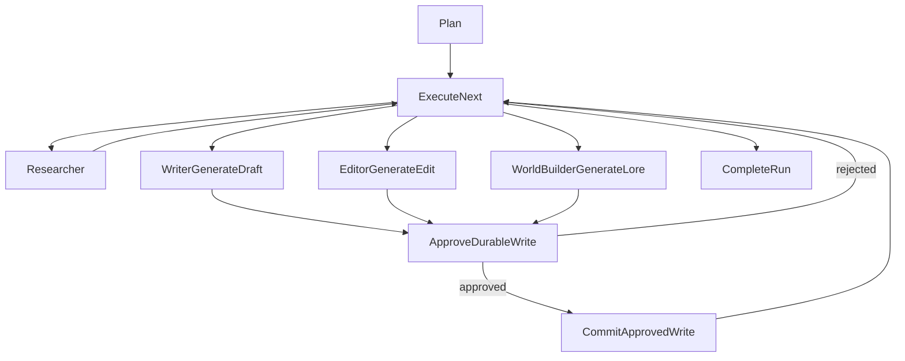

# Agent Persistence Revision

## Goal
Refactor the LangGraph agent so human approval is required only before agent-generated durable book/canon writes, not before routine planning or research. At the same time, document and tighten the MongoDB/Chroma data model so tools read through stable application abstractions while LangGraph checkpointer/store remain framework-managed persistence.

## Current Findings
- `server/app/agent/agent.py` routes `plan -> approval -> execute_next`, so every run pauses before any useful agent work.
- `server/app/agent/nodes/writer.py` writes a draft artifact and immediately inserts a `chapters` record through `add_chapter(...)`.
- `server/app/agent/nodes/editor.py` writes an edited artifact and immediately updates chapter content through `update_chapter_content(...)`.
- `server/app/agent/nodes/researcher.py` only writes a research artifact, which should remain automatic.
- `server/app/agent/nodes/world_builder.py` currently saves a world-building artifact only, but its intended final character/entity/system promotion should be approval-gated before writing to `character_bible` or `entity_bible`.
- Mongo app data is source-of-truth in collections such as `projects`, `user_assets`, `chapters`, `artifacts`, `character_bible`, `entity_bible`, `agent_runs`, and `chat_messages`.
- Chroma currently uses one logical collection, `project_knowledge`, with metadata such as `projectId`, `rootId`, `sourceKind`, `mongoCollection`, `artifactType`, `agentName`, `chunkIndex`, and `parentPreview`.
- Frontend preview currently maps `book.artifacts` into full `artifactContent` in `client/features/workspace/tabs/AgentTab.tsx` and renders it in `client/components/workspace/PreviewCanvas.tsx`, so large research/world/draft artifacts can bloat project payloads and chat-adjacent UI state.

## Proposed Graph Shape



## Agent Capability Matrix

Each agent should have a narrow capability envelope. Tools are model-visible read capabilities; durable writes are graph-owned commit actions.

| Agent | Reads / Tools | Auto-saved Outputs | Approval-gated Writes |
| --- | --- | --- | --- |
| Planner | Unified `retrieve_knowledge` for project facts, source summaries, and exact reads when needed | Planner decision on `agent_runs` | None |
| Researcher | Unified `retrieve_knowledge` for Chroma RAG and Mongo exact reads across source assets, chapters, artifacts, characters, and world entities | `research_notes` artifact | None |
| Writer | Unified `retrieve_knowledge` for source, research, chapter context, style, and continuity | `draft` artifact, streamed draft text | `chapters.insert` draft chapter |
| Editor | Unified `retrieve_knowledge` for draft, chapter, style, continuity, and artifact reads | `edited_content` artifact, streamed edit text | `chapters.update` content/status/summary |
| World Builder | Unified `retrieve_knowledge` for source, character, world/entity, artifact, and continuity reads | `world_building` artifact | `character_bible` and `entity_bible` create/update |
| Fact Checker / Future Specialist | Unified `retrieve_knowledge` for chapter, source, character, entity, artifact, and continuity reads | `fact_check_report` artifact | None unless it proposes a canon fix |

Tool rules:

- There should be one primary model-visible knowledge/application-data tool: `retrieve_knowledge`.
- `retrieve_knowledge(mode="rag", ...)` uses Chroma semantic search through `server/app/knowledge/service.py`.
- `retrieve_knowledge(mode="persistent", surface="...", operation="...", ...)` uses Mongo exact/list reads through `server/app/knowledge/tools.py`.
- Internal helper functions such as `read_chapter`, `read_character`, `read_world_entity`, `read_artifact`, and `read_project_sources` can remain implementation details behind the router, but should not be exposed as separate tiny model-facing tools unless there is a strong reason.
- Model-visible tools in `server/app/agent/utils/tools.py` should expose the unified router and an optional tool catalog/description, not many small DB-specific tools.
- Mutating actions are not model-callable tools. They are `pendingWrite` proposals committed by deterministic graph code after approval.
- Retrieval tools should prefer exact Mongo reads for full artifacts/chapters/source docs and Chroma RAG for targeted lookup.

## LangGraph-Native Tool Design

Docs guidance to follow:

- Define tools with `@tool` from LangChain.
- Use a Pydantic `args_schema` for the model-visible input.
- Use `ToolRuntime` for hidden runtime context such as project id, run id, current agent, current task, store, stream writer, and execution info.
- Bind tools to the model with `model.bind_tools([...])` when the model should decide whether to call tools.
- Execute model tool calls through LangGraph `ToolNode`.
- Keep mutating tools out of the model-visible tool list; route mutations through explicit graph approval/commit nodes.

Recommended tool surface:

```python
class RetrieveKnowledgeInput(BaseModel):
    mode: Literal["rag", "persistent"]
    query: str | None = None
    scopes: list[str] | None = None
    surface: Literal[
        "source_assets",
        "chapters",
        "characters",
        "world",
        "formal_memory",
        "artifacts",
    ] | None = None
    operation: Literal["list", "read"] | None = None
    ids: list[str] | None = None
    name: str | None = None
    max_results: int = 5
    max_chars: int = 12000
```

The model should not see or provide:

- `project_id`
- `agent_run_id`
- `thread_id`
- `agent`
- `task`
- allowed surfaces/scopes

Those should come from `ToolRuntime.context` or graph state/config and be enforced by backend code.

Per-agent access should be implemented as policy, not separate tools:

| Agent | Same Tool | Suggested Policy |
| --- | --- | --- |
| Planner | `retrieve_knowledge` | Can read project source summaries, assets, chapters, formal memory, artifacts; no mutation |
| Researcher | `retrieve_knowledge` | Broadest read access for source assets, chapters, characters, world, artifacts, RAG scopes |
| Writer | `retrieve_knowledge` | Reads source assets, research/artifacts, chapters, characters/world/style/continuity scopes |
| Editor | `retrieve_knowledge` | Reads chapters, artifacts, style, continuity, characters/world; no canon mutation |
| World Builder | `retrieve_knowledge` | Reads source assets, characters, world/entities, artifacts, continuity; writes only as `pendingWrite` proposals |
| Fact Checker / Future Specialist | `retrieve_knowledge` | Reads all relevant source/canon/artifact surfaces; produces reports/proposals only |

Implementation options:

- Preferred for model-driven retrieval: each specialist node calls a model bound with `[retrieve_knowledge]`; if tool calls are produced, route them to a shared `ToolNode`, append tool results, and call the model again until final content is produced.
- Acceptable for deterministic retrieval: graph nodes call the same `retrieve_knowledge` tool through `ToolNode` with planned arguments before the model turn.
- Avoid exposing `read_chapter`, `read_character`, `read_world_entity`, `read_artifact`, etc. as separate model-facing tools. Keep them as private functions called by `retrieve_knowledge`.
- Use the tool runtime stream writer for long retrieval/progress events if needed, but large generated artifacts should stream through artifact events, not tool responses.

## Database Schemas And Collections

### MongoDB Application Collections

MongoDB is the source of truth for application data. Agents and tools should access these records through repositories and `server/app/knowledge/tools.py`, not raw collection calls from prompts.

| Collection | Purpose | Important Fields | Writer / Owner |
| --- | --- | --- | --- |
| `projects` | Book/project metadata and settings | `_id`, `id`, `title`, `subtitle`, `genre`, `tonality`, `createdAt`, `bookSummary`, `settings` | App creates/settings; editor may update `bookSummary` after approved chapter publication |
| `user_assets` | User-provided source docs, brief, outlines, references | `_id`, `id`, `projectId`, `name`, `type`, `size`, `addedAt`, `content` | User/app writes; indexed into Chroma as `sourceKind=asset` |
| `chapters` | Durable book prose | `_id`, `id`, `projectId`, `number`, `title`, `content`, `summary`, `wordCount`, `status`, approval/source metadata to add | Writer/editor proposals commit only after approval |
| `artifacts` | Agent-generated reviewable outputs | `_id`, `id`, `projectId`, `agentRunId`, `agentName`, `artifactType`, `content`, `metadata`, `relatedChapterId`, `createdAt` | Agents auto-save; no approval required because artifacts are review surfaces, not committed canon/book content |
| `character_bible` | Durable character canon | `_id`, `id`, `projectId`, `name`, `role`, `arc`, `activeChapters`, `attributes`, `status`, approval/source metadata to add | World-builder proposals commit only after approval |
| `entity_bible` | Durable world/entity canon | `_id`, `id`, `projectId`, `name`, `type`, `description`, `attributes`, `status`, approval/source metadata to add | World-builder proposals commit only after approval |
| `agent_runs` | App orchestration metadata and timeline | `_id`, `projectId`, `sessionId`, `userMessageId`, `userPrompt`, `plannerDecision`, `agentExecutions`, `finalOutputMessageId`, `status`, `startedAt`, `completedAt`, `error` | App/graph automatic persistence for UI/audit, not LangGraph checkpoint storage |
| `chat_messages` | Chat UI history | `_id`, `projectId`, `sessionId`, `role`, `content`, `agentRunId`, `artifactReferences`, `createdAt` | App/user/assistant automatic persistence |

`agent_runs` is not the LangGraph thread/checkpointer/store. It is app-level timeline and UI/audit metadata. LangGraph persistence is separate:

- Checkpointer: short-term, thread-scoped graph state and pending writes. It uses `thread_id` from graph config and is required for interrupts/resume/time travel/fault tolerance.
- Store: long-term, cross-thread key-value memory for preferences/facts/shared memories.

Because this app compiles and runs LangGraph directly inside FastAPI instead of using LangGraph Agent Server, persistence must be configured in code. Do not create custom app collections named `threads` or `store` for LangGraph internals. Use official LangGraph checkpointer/store implementations and let them manage their own Mongo collections. Add an app `threads`/`chat_sessions` collection only if the frontend needs first-class session metadata beyond what `chat_messages` currently infers.

Current persistence status:

- Checkpointer: `server/app/agent/utils/persistence.py` already attempts to use `AsyncMongoDBSaver` from `langgraph-checkpoint-mongodb`, so graph checkpoints should persist to MongoDB when Mongo setup succeeds. The implementation should use the official async context/setup pattern from LangGraph docs so collections are created reliably.
- Store: currently `InMemoryStore`, so it is not Mongo-backed yet. If we need durable LangGraph long-term memory, replace it with the official MongoDB store from `langgraph-checkpoint-mongodb`. The store implementation manages its own Mongo collections; the app should not manually create a custom store schema.

### ChromaDB Collections

ChromaDB is a derived semantic index, not source of truth.

| Collection | Source Mongo Collections | Metadata Filter Strategy |
| --- | --- | --- |
| `project_knowledge` | `chapters`, `character_bible`, `entity_bible`, `user_assets`, `artifacts` | Always filter by `projectId`; domain scopes map to `sourceKind` filters |

Common vector metadata:

- `projectId`
- `sourceName`
- `rootId`
- `parentId`
- `chunkIndex`
- `chunkCount`
- `parentIndex`
- `childIndex`
- `chunkStart`
- `chunkEnd`
- `headingPath`
- `parentPreview`
- `chunkingStrategy`
- `mongoCollection`
- `sourceKind`

Type-specific vector metadata:

- Chapter: `mongoCollection=chapters`, `sourceKind=chapter`, `number`, `status`
- Character: `mongoCollection=character_bible`, `sourceKind=character`, `role`
- Entity/world: `mongoCollection=entity_bible`, `sourceKind=world`, `entityType`
- Asset: `mongoCollection=user_assets`, `sourceKind=asset`, `assetType`
- Artifact: `mongoCollection=artifacts`, `sourceKind=artifact`, `artifactType`, `agentName`

Scope mapping:

- `assets` -> `sourceKind=asset`
- `chapters`, `narrative`, `scenes` -> `sourceKind=chapter`
- `characters` -> `sourceKind=character|asset`
- `world`, `entities`, `locations`, `organizations`, `objects` -> `sourceKind=world|asset`
- `plot` -> `sourceKind=chapter|asset|artifact`
- `continuity` -> `sourceKind=chapter|character|world|asset|artifact`
- `style` -> `sourceKind=asset|artifact`
- `artifacts`, `research` -> `sourceKind=artifact` plus relevant asset fallback where configured

## Implementation Steps

1. Replace plan-level approval with write-level approval.
   - Update `server/app/agent/agent.py` to remove `approval_node` after `plan`.
   - Route `plan` directly to `execute_next`.
   - Add new nodes such as `approve_write`, `commit_write`, and optionally `skip_write`.
   - Keep `rejected_node` only for write rejection if needed, not whole-run cancellation by default.

2. Extend agent state with pending durable write proposals.
   - Update `server/app/agent/utils/state.py` with a `PendingWrite` shape.
   - Include fields like `kind`, `agent`, `task`, `artifactId`, `payload`, `targetCollection`, `operation`, `status`, and optional `targetId`.
   - Keep generated content in state/artifacts before approval, but do not write chapter/canon DB records yet.

3. Split generation from commit for chapter writes.
   - In `server/app/agent/nodes/writer.py`, keep creating the draft artifact automatically, but stop calling `add_chapter(...)` inside the writer node.
   - Instead, return a `pendingWrite` proposal for `chapters.insert` with title, number, content, word count, status `draft`, and related artifact id.
   - In `server/app/agent/nodes/editor.py`, keep creating the edited artifact automatically, but stop calling `update_chapter_content(...)` directly.
   - Return a `pendingWrite` proposal for `chapters.update` with the target chapter id and edited content.

4. Add approval and commit nodes for durable writes.
   - Create a node that calls LangGraph `interrupt(...)` only when `pendingWrite` exists.
   - Approval payload should describe exactly what will be written: collection, operation, target, title/name, source artifact, and preview.
   - Create a commit node that dispatches approved proposals through repository functions only, never raw DB writes.
   - Supported initial proposal kinds: `chapter_create`, `chapter_update`, `character_create`, `character_update`, `entity_create`, `entity_update`.

5. Prepare world-builder canon promotion path.
   - Keep `server/app/agent/nodes/world_builder.py` saving world-building artifacts automatically.
   - Add a structured proposal extraction/normalization step before writing characters/entities.
   - Commit approved character/entity proposals through `server/app/repositories/characters.py` and `server/app/repositories/entities.py`.
   - If world-builder only creates notes, no approval is needed until a concrete DB write proposal exists.

6. Revise Mongo schema contracts and indexes.
   - Align schema docs in `server/app/schemas/*.py` with actual repository behavior.
   - Normalize status literals where code currently uses both `completed` and schema docs say `published`.
   - Add approval metadata to durable agent-written records, for example `createdByAgentRunId`, `sourceArtifactId`, `approvedAt`, `approvedBy`, and `approvalDecision` where useful.
   - Add or confirm indexes for efficient tool reads: project + number for chapters, project + name for characters/entities, project + type + name for entities, and project + artifact type + createdAt for artifacts.
   - Remove `retrieval_logs` from the app schema/init plan; use Langfuse retriever observations for retrieval telemetry instead.
   - Keep `agent_runs` as app-level timeline/run metadata unless replacing the current frontend timeline with `graph.get_state_history(...)`.

7. Configure LangGraph persistence correctly.
   - Keep using `AsyncMongoDBSaver` for the checkpointer so `thread_id` based graph checkpoints, interrupts, and resumes are durable.
   - Verify the checkpointer setup follows the official async MongoDB saver pattern and creates/uses its internal Mongo collections reliably.
   - Replace `InMemoryStore` in `server/app/agent/utils/persistence.py` with the official Mongo-backed LangGraph store if the app needs cross-thread long-term LangGraph memory.
   - Verify the Mongo-backed store setup follows the official LangGraph store pattern and creates/uses its internal Mongo collections reliably.
   - Do not manually design Mongo schemas for checkpoint/store internals; official `langgraph-checkpoint-mongodb` owns those collections.
   - If a user-visible list of chat/agent threads is needed, model that separately as app metadata, not as the checkpointer itself.

8. Revise Chroma metadata strategy.
   - Keep Mongo as source of truth and Chroma as derived index.
   - Keep one `project_knowledge` collection unless performance requires splitting later; the existing metadata filters already support scopes.
   - Standardize metadata across indexed documents: `projectId`, `rootId`, `mongoCollection`, `sourceKind`, `sourceName`, `status`, `createdAt` or source timestamp, `artifactType`, `agentName`, `entityType`, `chapterNumber`, and chunk fields.
   - Ensure draft/unapproved content is either excluded from canon scopes or tagged clearly as `status=draft` / `approvalStatus=pending` so retrieval tools can prefer approved/published records for continuity.

9. Tighten official tool exposure.
   - Keep `server/app/knowledge/tools.py` as business/domain read layer.
   - Collapse model-visible access to one primary LangChain/LangGraph tool, `retrieve_knowledge`, with a typed schema that supports both Chroma and Mongo modes.
   - Implement `retrieve_knowledge` with `@tool`, Pydantic `args_schema`, and `ToolRuntime` so project/run/agent/task context is hidden from the model.
   - Bind `retrieve_knowledge` to each specialist model that should decide when to retrieve, and execute tool calls through shared LangGraph `ToolNode`.
   - Enforce per-agent surface/scope policy in tool runtime context instead of creating separate tiny tools per agent.
   - Route Mongo exact reads via `mode="persistent"` and `surface="source_assets|chapters|characters|world|formal_memory|artifacts"`.
   - Route Chroma semantic search via `mode="rag"` and `scopes=[...]`.
   - Keep tiny read helpers as internal functions inside `knowledge.tools.py`; do not bind them individually to every agent.
   - Tools should remain read-only unless explicitly routed through approval/commit nodes.
   - Avoid exposing raw DB mutation tools to the model.

10. Add artifact save and preview streaming/loading.
   - Keep `create_artifact(...)` as the durable artifact save point for research notes, drafts, edited content, world-building notes, and future reports.
   - Add API routes for artifact access that do not require loading full artifact bodies in the whole project payload, for example `GET /api/projects/{project_id}/artifacts`, `GET /api/projects/{project_id}/artifacts/{artifact_id}`, and optionally a streaming endpoint for large content.
   - Return artifact list items with metadata and short previews only; fetch full content lazily when the user opens the preview.
   - Stream newly generated artifact chunks or final artifact references through LangGraph custom events such as `artifact_delta`, `artifact_saved`, and `artifact_preview_ready`.
   - Update `client/features/workspace/tabs/AgentTab.tsx` so preview uses artifact ids and lazy-loaded content instead of always embedding full `artifactContent` from `book.artifacts`.
   - Update `client/components/workspace/PreviewCanvas.tsx` to support loading states, streamed artifact text, and full artifact content fetched on demand.
   - Keep chat messages small: final assistant messages should reference artifact ids, not duplicate full research/draft bodies.

11. Update streaming/API behavior.
   - Keep `server/app/api/agent.py` resume handling through `Command(resume=...)`.
   - Change frontend-facing interrupt payloads from `plan_approval` to write-focused kinds such as `write_approval`.
   - Emit custom events for `write_proposed`, `write_approved`, `write_rejected`, and `write_committed`.
   - Include artifact reference events so the frontend can update preview/history without waiting for a full project refresh.

12. Validate with focused tests/checks after implementation.
   - Research-only prompt should run without approval and auto-save only a research artifact.
   - Large research artifact should stream or appear as a preview-ready artifact without bloating chat messages.
   - Draft chapter prompt should generate artifact, pause before chapter insert, then write chapter only after approval.
   - Edit prompt should pause before chapter update.
   - World/canon prompt should pause only before character/entity bible writes.
   - Rejected writes should leave artifacts for review but not mutate `chapters`, `character_bible`, or `entity_bible`.

## Files To Change First
- `server/app/agent/agent.py`
- `server/app/agent/utils/state.py`
- `server/app/agent/utils/routing.py`
- `server/app/agent/nodes/planner.py`
- `server/app/agent/nodes/writer.py`
- `server/app/agent/nodes/editor.py`
- `server/app/agent/nodes/world_builder.py`
- New write approval/commit helper under `server/app/agent/nodes/` or `server/app/agent/utils/`
- `server/app/schemas/*.py`
- `server/app/infrastructure/database/mongo.py`
- `server/app/services/indexing.py`
- `server/app/knowledge/scopes.py`
- `server/app/agent/utils/tools.py`
- `server/app/api/projects.py` or a dedicated artifacts API module
- `client/features/workspace/tabs/AgentTab.tsx`
- `client/features/workspace/hooks/useAgentStream.ts`
- `client/components/workspace/PreviewCanvas.tsx`
- `client/lib/api/projects.ts`
- `client/lib/types/project.ts`

## Non-Goals
- Do not require approval for research artifacts, agent run records, chat messages, LangGraph checkpoints, or LangGraph store writes.
- Do not let LLM tools write directly to Mongo/Chroma.
- Do not replace MongoDB/Chroma abstractions with raw database access in graph nodes.
- Do not split Chroma collections unless the metadata-filtered single collection proves insufficient.
- Do not send full large artifacts in every project/workspace payload once lazy artifact loading is available.
