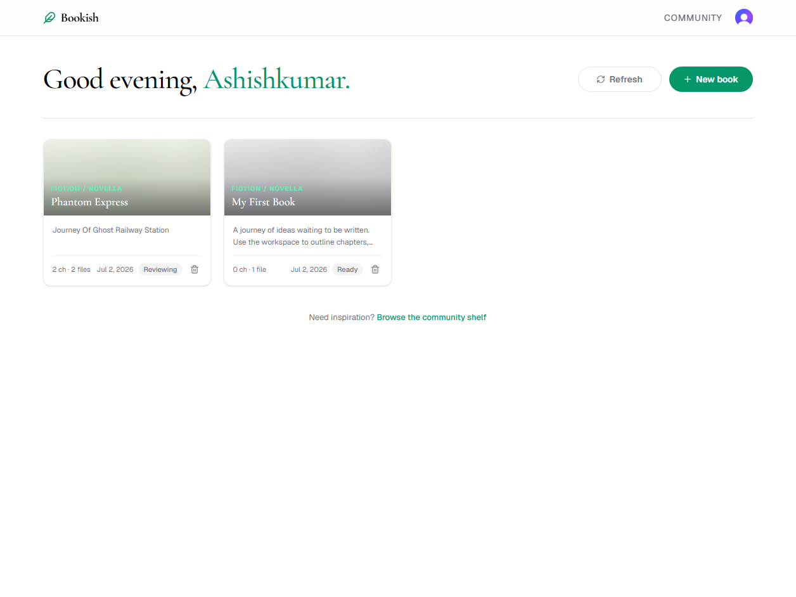
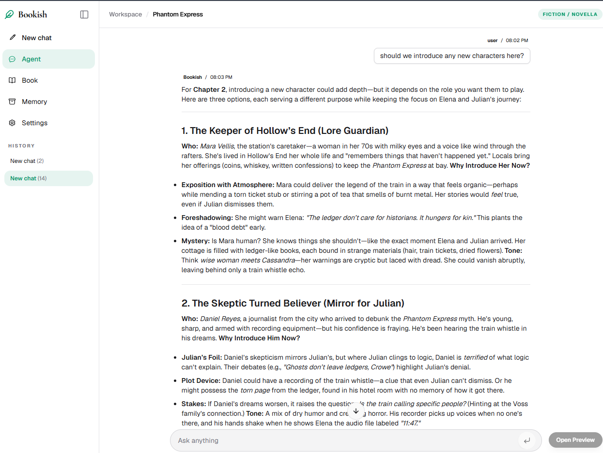
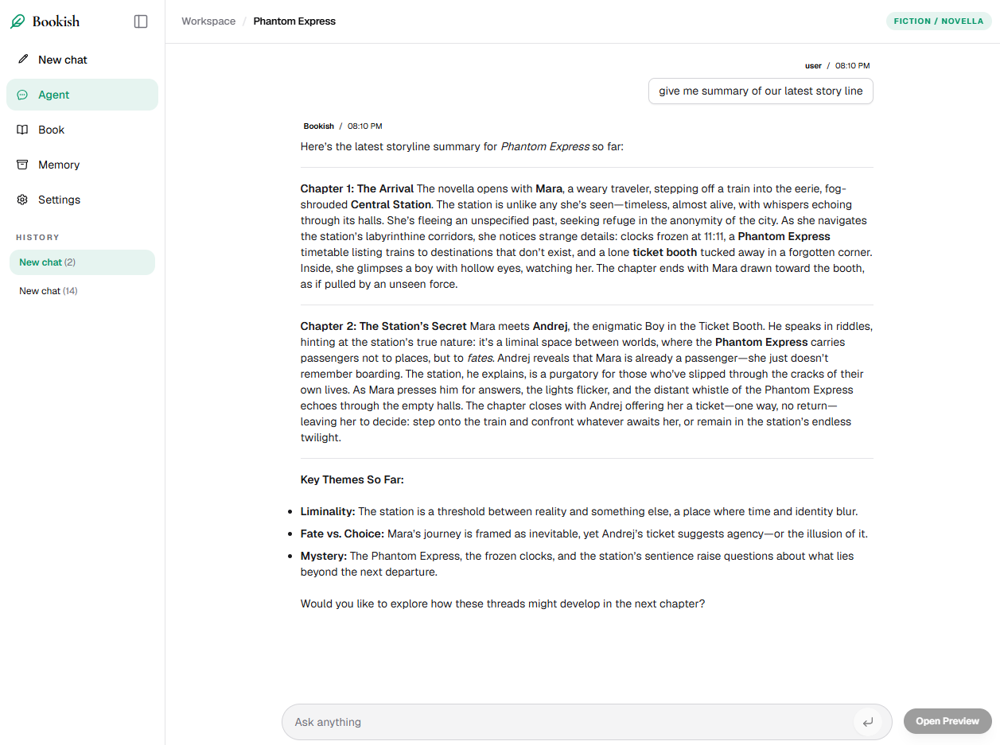
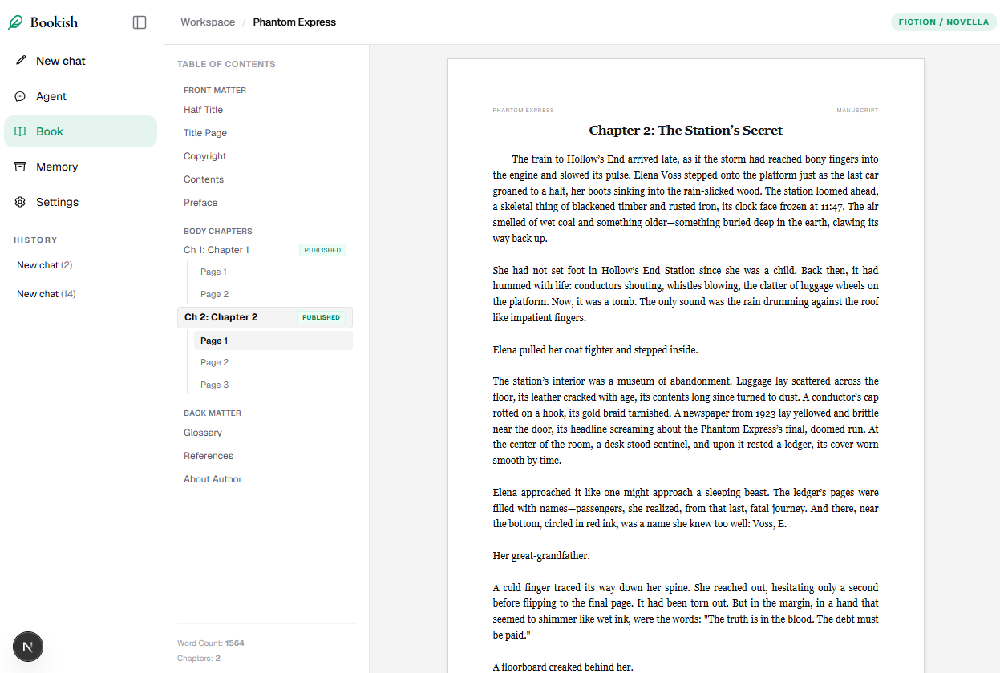
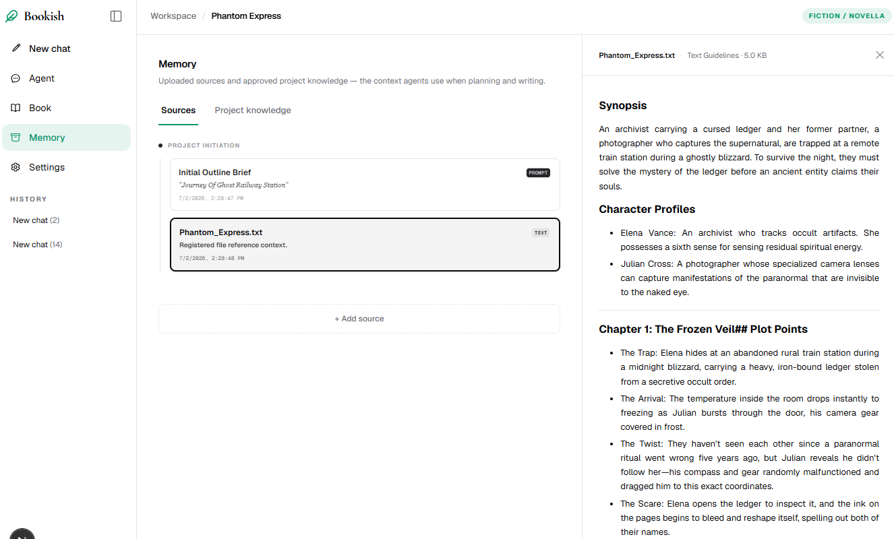

# Bookish

**AI-assisted book writing platform** — turn a brief into structured chapters, world bibles, and polished prose using a planner-orchestrated multi-agent pipeline with human-in-the-loop approval.

Monorepo: **Next.js 16** workspace UI + **FastAPI / LangGraph** backend with **MongoDB** (source of truth) and **ChromaDB** (semantic RAG). Authentication via **Clerk**.

---

## Screenshots

### Workspace

Your projects at a glance — open a book, start a new one, or browse the community shelf.



### Agent

Chat with the planner and specialists. Ask for plot ideas, character suggestions, or a recap of the story so far.





### Book

Structured manuscript view with front matter, chapters, and back matter.



### Memory

Upload sources and browse approved project knowledge — the context agents use when planning and writing.



---

## Tech Stack

| Layer | Technologies |
|-------|-------------|
| **Frontend** | Next.js 16, React 19, TypeScript, Tailwind CSS 4, TipTap, Clerk |
| **Backend** | Python 3.12+, FastAPI, LangGraph, Langfuse |
| **Databases** | MongoDB, ChromaDB (embeddings) |
| **Auth** | Clerk (JWT via JWKS, webhook for user provisioning) |
| **Tooling** | uv (Python), npm |

---

## Architecture

```
Client (Next.js)
  ↕ REST + SSE
FastAPI
  ↕
LangGraph (Planner → Agents)
  ↕                    ↕
MongoDB            ChromaDB
(source of truth)  (semantic index)
```

**Typical chapter flow:** `planner` → `researcher / world_builder / writer` → HITL approval → `commit_write`

---

## Repository Structure

```
bookish/
├── client/                     # Next.js app
│   ├── app/                    # Routes: /, /explore, /workspace, /book/[id], /sign-in, /sign-up
│   ├── components/
│   │   ├── public/             # PublicNav, PublicFooter, marketing sections
│   │   └── workspace/         # Agent tab, Book tab, Memory tab, Settings tab
│   ├── contexts/
│   │   ├── AuthProvider.tsx    # useAuth hook (Clerk wrapper)
│   │   └── ClerkTokenSync.tsx  # Wires Clerk token into API client
│   ├── features/workspace/     # Workspace hooks and tabs
│   └── lib/api/                # HTTP + SSE client (injects Bearer token)
├── server/                     # FastAPI backend
│   ├── app/
│   │   ├── api/                # HTTP handlers
│   │   │   ├── projects.py     # Project CRUD (auth-protected, user-scoped)
│   │   │   ├── agent.py        # LangGraph SSE streaming endpoint
│   │   │   ├── webhooks.py     # Clerk webhook (user.created → default project)
│   │   │   └── deps.py         # get_current_user JWT dep + require_owned_project
│   │   ├── agent/              # LangGraph graph, state, nodes, tools
│   │   ├── knowledge/          # KB service + retrieval
│   │   ├── repositories/       # Mongo CRUD (auto-indexes to Chroma on write)
│   │   ├── infrastructure/     # Mongo, ChromaDB, LLM service
│   │   └── prompts/            # Agent system prompts (source of truth)
│   └── pyproject.toml
├── README.md
├── PRODUCT.md
├── LEARNING.md
└── AGENTS.md
```

---

## Prerequisites

- **Node.js** 20+ and npm
- **Python** 3.12+ and [uv](https://github.com/astral-sh/uv)
- **MongoDB** (local or Atlas)
- **Clerk** account with an app, publishable key, and secret key
- At least one **LLM API key** (NVIDIA, OpenAI, or Anthropic)

---

## Quick Start

### 1. Clone

```bash
git clone <repo-url>
cd bookish
```

### 2. Backend — `server/.env`

```env
MONGO_URI=mongodb://localhost:27017/
MONGO_DB_NAME=bookish

# LLM (configure per-project in settings UI)
NVIDIA_API_KEY=
OPENAI_API_KEY=
ANTHROPIC_API_KEY=

# Clerk
CLERK_SECRET_KEY=sk_...
CLERK_WEBHOOK_SECRET=whsec_...   # from Clerk Dashboard → Webhooks

# Optional
LANGFUSE_SECRET_KEY=
LANGFUSE_PUBLIC_KEY=
LANGFUSE_BASE_URL=https://cloud.langfuse.com
```

```bash
cd server
uv sync
uv run uvicorn app.main:app --reload --host 127.0.0.1 --port 8000
```

### 3. Frontend — `client/.env.local`

```env
NEXT_PUBLIC_API_URL=http://localhost:8000
NEXT_PUBLIC_CLERK_PUBLISHABLE_KEY=pk_...
CLERK_SECRET_KEY=sk_...
NEXT_PUBLIC_CLERK_SIGN_IN_URL=/sign-in
NEXT_PUBLIC_CLERK_SIGN_UP_URL=/sign-up
NEXT_PUBLIC_CLERK_AFTER_SIGN_IN_URL=/
NEXT_PUBLIC_CLERK_AFTER_SIGN_UP_URL=/
```

```bash
cd client
npm install
npm run dev
```

Open [http://localhost:3000](http://localhost:3000).

### 4. Clerk Webhook (for default project on signup)

In [Clerk Dashboard](https://dashboard.clerk.com) → **Webhooks** → create endpoint:
- **URL**: `https://your-server/api/webhooks/clerk`
- **Events**: `user.created`
- Copy the signing secret into `CLERK_WEBHOOK_SECRET`

Use [ngrok](https://ngrok.com/) for local development: `ngrok http 8000`

---

## API Overview

| Method | Path | Auth | Description |
|--------|------|------|-------------|
| `GET` | `/api/projects` | ✅ | List user's projects (summaries) |
| `POST` | `/api/projects` | ✅ | Create project |
| `GET` | `/api/projects/{id}` | ✅ | Full workspace payload |
| `DELETE` | `/api/projects/{id}` | ✅ | Delete project |
| `POST` | `/api/agent/threads` | — | Create LangGraph thread |
| `POST` | `/api/agent/threads/{id}/runs/stream` | — | Stream/resume agent run (SSE) |
| `GET` | `/api/projects/{id}/messages` | ✅ | Chat history |
| `POST` | `/api/projects/{id}/settings` | ✅ | Per-agent model routing |
| `POST` | `/api/webhooks/clerk` | Svix | Clerk `user.created` hook |

---

## Development

### Run locally

After [Quick Start](#quick-start) env files are in place, start MongoDB, then run the API and UI in **two terminals**:

**Terminal 1 — API**

```bash
cd server
uv sync                    # first run, or after pulling dependency changes
uv run uvicorn app.main:app --reload --host 127.0.0.1 --port 8000
```

**Terminal 2 — UI**

```bash
cd client
npm install                # first run, or after pulling dependency changes
npm run dev
```

| Service | URL |
|---------|-----|
| Frontend | [http://localhost:3000](http://localhost:3000) |
| API | [http://localhost:8000](http://localhost:8000) |
| API docs | [http://localhost:8000/docs](http://localhost:8000/docs) |

Sign in via Clerk, then open **Workspace** to create or open a project. Agent runs stream over SSE; project data is stored in MongoDB and indexed into Chroma on write.

### Common tasks

```bash
# Lint frontend
cd client
npm run lint

# Production build (frontend)
cd client
npm run build

# Reindex Chroma vectors after a data migration or manual DB edits
cd server
uv run python scripts/reindex.py <project_id>
```

**Defaults:** API `127.0.0.1:8000` · UI `localhost:3000` · Chroma data `server/chroma_db/` (gitignored)
