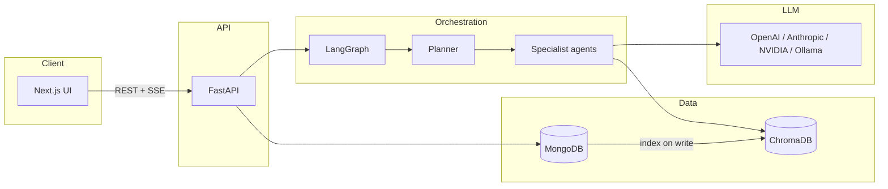

# Bookish

**AI-assisted book writing platform** — turn a brief into structured chapters, world bibles, and polished prose using a **planner-orchestrated multi-agent pipeline** with human-in-the-loop approval.

Monorepo: **Next.js** workspace UI + **FastAPI / LangGraph** backend with **MongoDB** (source of truth) and **ChromaDB** (semantic RAG).

---

## Features

- **Project workspace** — create books from a title, genre, and brief; attach reference assets (Markdown / text).
- **Planner-first agents** — one LLM planner decomposes each user message into an ordered task list or answers directly in chat.
- **Specialist agents** — research, world-building, drafting, fact-checking, humanizing, and editing in a LangGraph DAG.
- **Human-in-the-loop (HITL)** — approve execution plans and world-bible saves before they commit.
- **Streaming UX** — Server-Sent Events (SSE) for live tokens, agent status, and document streams.
- **Semantic memory** — Chroma vector search over chapters, characters, entities, and style guides (`search_rag`, `read_chapter`).
- **Rich editor** — TipTap-based chapter editing, outline, memory panel, and agent flow trace in the client.
- **Observability** — optional [Langfuse](https://langfuse.com) tracing for LLM and agent spans.

---

## Architecture



**Typical chapter flow:** `researcher` → `writer` → `fact_checker` → `humanizer` → `editor` (planner chooses agents per request).

---

## Tech stack

| Layer | Technologies |
|-------|----------------|
| **Frontend** | Next.js 16, React 19, TypeScript, Tailwind CSS 4, TipTap |
| **Backend** | Python 3.12+, FastAPI, LangGraph, Langfuse |
| **Databases** | MongoDB, ChromaDB (embeddings) |
| **Tooling** | [uv](https://github.com/astral-sh/uv) (Python), npm |

---

## Repository structure

```
bookish/
├── client/                 # Next.js app (workspace UI) — see client/README.md
│   ├── app/                # Routes (dashboard + /book/[id])
│   ├── features/workspace/ # Workspace hooks, tabs, WorkspaceView
│   ├── components/workspace/
│   └── lib/api/            # HTTP + SSE client
├── server/                 # FastAPI backend
│   ├── app/                # Application package (production code)
│   │   ├── api/routes/     # HTTP handlers
│   │   ├── agents/         # LangGraph + nodes + runtime
│   │   ├── core/           # Shared utilities
│   │   ├── infrastructure/ # Mongo, Chroma, LLM
│   │   ├── repositories/   # Data access
│   │   ├── services/       # Indexing, RAG retrieval
│   │   ├── schemas/        # API models
│   │   └── prompts/        # Agent system prompts (source of truth)
│   ├── docs/               # Backend documentation
│   └── scripts/            # e.g. vector reindex CLI
└── README.md               # This file
```

> Backend details: [server/docs/README.md](server/docs/README.md)

---

## Prerequisites

- **Node.js** 20+ and npm
- **Python** 3.12+ and [uv](https://github.com/astral-sh/uv)
- **MongoDB** (local or Atlas)
- At least one **LLM API key** (e.g. NVIDIA, OpenAI, Anthropic) configured in project settings or env

---

## Quick start

### 1. Clone and configure

```bash
git clone <your-repo-url>
cd bookish
```

**Backend** — create `server/.env`:

```env
MONGO_URI=mongodb://localhost:27017/
MONGO_DB_NAME=bookish

# Provider keys (use what you configure in the UI)
NVIDIA_API_KEY=
OPENAI_API_KEY=
ANTHROPIC_API_KEY=

# Optional: OpenAI embeddings for Chroma
# EMBEDDING_PROVIDER=openai

# Optional: Langfuse
# LANGFUSE_SECRET_KEY=
# LANGFUSE_PUBLIC_KEY=
# LANGFUSE_HOST=https://cloud.langfuse.com
```

**Frontend** — optional `client/.env.local`:

```env
NEXT_PUBLIC_API_URL=http://localhost:8000
```

### 2. Start the API

```bash
cd server
uv sync
uv run uvicorn app.main:app --reload --host 127.0.0.1 --port 8000
```

Health check: [http://127.0.0.1:8000/](http://127.0.0.1:8000/)

### 3. Start the UI

```bash
cd client
npm install
npm run dev
```

Open [http://localhost:3000](http://localhost:3000), create a project, and chat in the workspace.

---

## Agent roster

| Agent | Role |
|-------|------|
| **Planner** | Analyzes the request; plans tasks or replies directly |
| **Researcher** | Gathers context via RAG; produces research notes |
| **World builder** | Creates characters / entities (HITL before DB save) |
| **Writer** | Drafts chapter prose |
| **Fact checker** | Continuity audit vs bible and lore |
| **Humanizer** | Reduces AI tone; aligns voice |
| **Editor** | Polish and publish chapter; updates book summary |

Prompts live in `server/app/prompts/` — see [server/docs/AGENTS.md](server/docs/AGENTS.md).

---

## API overview

| Method | Path | Description |
|--------|------|-------------|
| `GET` | `/api/projects` | List projects (summary) |
| `POST` | `/api/projects` | Create project |
| `GET` | `/api/projects/{id}` | Full workspace payload |
| `DELETE` | `/api/projects/{id}` | Delete project |
| `POST` | `/api/agent/threads` | Create a LangGraph thread |
| `POST` | `/api/agent/threads/{thread_id}/runs/stream` | Stream or resume a LangGraph run |
| `GET` | `/api/projects/{id}/messages` | Chat history |
| `GET/PUT` | `/api/projects/{id}/settings` | Per-agent model routing |

Message body example:

```json
{ "projectId": "project_...", "message": "Write chapter 1 based on my brief." }
```

---

## Documentation

| Document | Description |
|----------|-------------|
| [server/docs/README.md](server/docs/README.md) | Setup, API, testing, Langfuse |
| [server/docs/ARCHITECTURE.md](server/docs/ARCHITECTURE.md) | Package layout and performance |
| [server/docs/AGENTS.md](server/docs/AGENTS.md) | Orchestration, RAG, workflows |

---

## Development

### Reindex vectors (after data migration or embedding change)

```bash
cd server
uv run python scripts/reindex.py project_<your_project_id>
```

### Lint frontend

```bash
cd client
npm run lint
```

### Useful defaults

- API: `127.0.0.1:8000`
- UI: `localhost:3000`
- Chroma data: `server/chroma_db/` (gitignored)

---

## Contributing

1. Use the `app/` package under `server/` for all backend changes.
2. Edit agent behavior in `server/app/prompts/` and `server/app/agent/utils/nodes/`, not duplicated markdown copies.
3. Update [server/docs/AGENTS.md](server/docs/AGENTS.md) when changing orchestration or workflows.

---

## License

License not specified in this repository. Add a `LICENSE` file if you intend to open-source the project.
