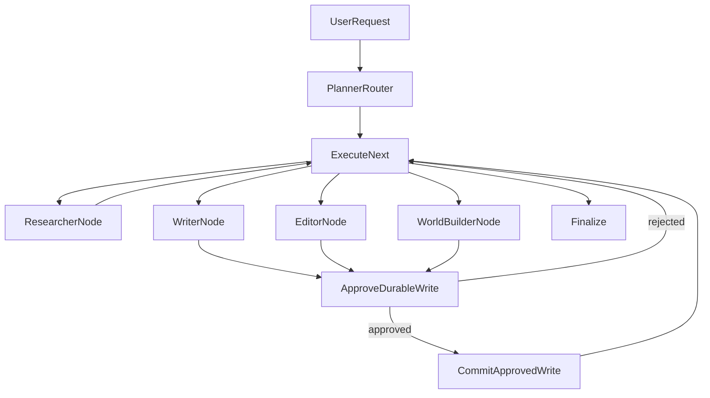

# How LangChain, LangGraph, and DeepAgents Combine

Source: LangChain/LangGraph docs MCP.

LangChain, LangGraph, and DeepAgents overlap because they live in the same ecosystem and share primitives. They are not the same layer.

The clearest mental model is:

1. LangChain is the framework.
2. LangGraph is the runtime.
3. DeepAgents is the harness.

## Layer Model

| Layer | Main Role | Provides | Best For |
| --- | --- | --- | --- |
| LangChain | Agent framework | Models, tools, prompts, middleware, agent loop, integrations | Building configurable tool-calling agents |
| LangGraph | Orchestration runtime | State, nodes, edges, persistence, streaming, interrupts, stores | Building stateful, durable, multi-step workflows |
| DeepAgents | Opinionated harness | Planning, subagents, virtual filesystem, memory, permissions, context management | Building complex autonomous agents quickly |

## How They Depend On Each Other

LangChain agents are built on top of LangGraph. You can use LangChain without thinking much about LangGraph, but LangGraph powers the durable runtime capabilities behind modern LangChain agents.

LangGraph can use LangChain components, but does not require the LangChain agent harness. In practice, most applications use LangChain tools, messages, model integrations, or retrievers inside LangGraph nodes.

DeepAgents is built on top of LangChain and LangGraph. It uses the same core tool-calling ideas, plus LangGraph production runtime capabilities, and adds an opinionated harness for planning, subagents, filesystem work, long-term memory, permissions, and context management.

## Shared Concepts

They share these concepts:

- Models: the LLMs that reason and produce messages.
- Tools: callable functions with typed inputs and descriptions.
- Messages: structured conversation data passed to models.
- Streaming: live events from model output, tool calls, and execution progress.
- Memory: short-term thread state and long-term persistent knowledge.
- Human-in-the-loop: runtime pauses for approval or correction.
- Observability: tracing, debugging, and evaluation through LangSmith.

The difference is where each concept is controlled.

## Same Concept, Different Layer

### Tools

LangChain defines tools and lets models call them in an agent loop.

LangGraph executes tools as part of graph nodes or via `ToolNode`, and stores the tool result in graph state or messages.

DeepAgents accepts LangChain tools, custom functions, and MCP tools, then combines them with built-in planning, filesystem, and subagent tools.

### Memory

LangChain exposes memory and store access through the agent runtime.

LangGraph separates thread-scoped state/checkpoints from long-term store memory.

DeepAgents adds memory files, skill loading, context offloading, summarization, and filesystem-backed memory patterns.

### Human Approval

LangChain can provide human-in-the-loop behavior through middleware.

LangGraph provides interrupts as a core runtime primitive.

DeepAgents uses LangGraph interrupts behind a simple `interrupt_on` style harness configuration.

### Streaming

LangChain streams agent messages and tool progress.

LangGraph streams graph events, node updates, state values, messages, custom events, tasks, and checkpoints.

DeepAgents streams the harness plus subagent activity.

## LangGraph Multi-Agent Patterns

LangGraph and LangChain document several ways to build multi-agent systems. They are not interchangeable; each pattern controls context, routing, and state differently.

### Prompt Chaining

Prompt chaining runs fixed steps in sequence, where each step consumes the previous step's output.

Use it when:

- The workflow is predictable.
- Each step has a clear input/output contract.
- You want easy validation between stages.

Bookish fit:

- Useful inside a specialist, such as `draft -> critique -> revise`.
- Not enough for the full system because Bookish needs dynamic task selection, persistence, approval gates, and different durable write boundaries.

### Routing

Routing classifies the request and sends it to one or more specialized nodes. LangGraph supports single-agent routing with `Command(goto=...)` and parallel fan-out with `Send(...)`.

Use it when:

- The system has clear specialist categories.
- A planner/router can decide which agents should run.
- You want predictable graph structure and UI-visible state.

Bookish fit:

- This is the best base pattern for the main pipeline.
- The planner creates ordered tasks, then `execute_next` routes to `researcher`, `writer`, `editor`, `world_builder`, or future specialists.
- It matches the product model: the app owns the workflow, state, approvals, artifacts, and database commits.

### Orchestrator-Worker

An orchestrator decomposes work into subtasks, sends each subtask to workers, and synthesizes their outputs. LangGraph supports dynamic workers with the `Send` API.

Use it when:

- The number of subtasks is not known ahead of time.
- Independent work can run in parallel.
- Worker outputs need a synthesis step.

Bookish fit:

- Useful later for large research passes, multi-chapter planning, or comparing multiple continuity checks in parallel.
- Not the default for chapter generation because chapter writing and editing are sequential and approval-sensitive.

### Evaluator-Optimizer

One node generates content and another evaluates it. If the output does not meet criteria, feedback loops back into generation.

Use it when:

- Quality criteria are explicit.
- Iteration is expected.
- The evaluator can give actionable feedback.

Bookish fit:

- Strong fit inside writer/editor/fact-check flows.
- Example: `writer -> fact_checker -> writer_revision` before proposing a chapter write.
- Should be scoped carefully to avoid runaway cost and repeated approvals.

### Subgraphs

A subgraph is a graph used as a node in another graph. Subgraphs can share state with the parent graph or use private state through wrapper nodes.

Use it when:

- A specialist becomes complex enough to need its own internal graph.
- Teams need to own separate graph modules.
- You want isolated state or private message history per specialist.

Bookish fit:

- Good second step after the main routing graph stabilizes.
- The root graph should keep ownership of planning, task routing, approval, commits, and final response.
- Specialist internals can become subgraphs later, for example a `writer_subgraph` with retrieval, drafting, self-critique, and revision.

### Supervisor And Subagents

In the subagents pattern, a main supervisor agent calls specialized subagents as tools. The supervisor decides when to invoke each subagent and combines results.

Use it when:

- You need strong context isolation.
- Subtasks can be delegated as standalone jobs.
- A central agent should dynamically decide what to call across turns.

Bookish fit:

- Useful for optional assistant-like workflows or broad autonomous research.
- Less suitable for the core writing pipeline because database commits, approval boundaries, artifact streaming, and UI state should be deterministic and inspectable.
- If used, subagents should be wrapped inside a specialist node, not replace the root graph.

### Handoffs

In the handoffs pattern, tool calls update state such as `active_agent` or `current_step`, transferring control to another agent or changing the current agent's prompt/tools.

Use it when:

- Agents need to converse directly with the user.
- The active agent should persist across turns.
- The flow is a multi-stage conversation with stateful transfers.

Bookish fit:

- Not the right default for the main backend pipeline.
- Bookish should not let agents freely hand control to each other when durable writes require deterministic approval gates.
- Handoffs may fit a future conversational support/assistant mode, not the book-production graph.

### Skills

Skills load specialized instructions and knowledge on demand while a single agent remains in control.

Use it when:

- The task benefits from domain instructions that should not always be in context.
- You want progressive disclosure without spawning agents.

Bookish fit:

- Useful for prompts and style packs, for example "romance editor", "fantasy worldbuilding", or "copyediting checklist".
- Skills complement the graph; they do not replace routing, persistence, or approval nodes.

## Pattern Recommendation For Bookish

Bookish should use a custom LangGraph workflow with a router/orchestrator shape:



Recommended evolution:

- Start with the root routing graph because it is easiest to inspect, stream, and approval-gate.
- Use one model-visible `retrieve_knowledge` tool for all agents, with per-agent policy enforced in runtime context.
- Add evaluator-optimizer loops inside writer/editor/fact-checker only where quality gains justify the cost.
- Convert complex specialists into subgraphs after their internal workflow becomes stable.
- Keep handoffs and DeepAgents out of the core production graph unless the product intentionally wants autonomous conversational control.

## Recommended Bookish Architecture

Bookish should combine them like this:

```text
Client UI
  |
  | streams graph events and messages
  v
FastAPI API
  |
  | invokes/resumes LangGraph runs
  v
LangGraph runtime
  |
  | state, nodes, edges, interrupts, checkpoints, store
  v
Specialist nodes
  |
  | use LangChain model/tool primitives
  v
LLMs, MongoDB, ChromaDB, project services
```

## What Each Layer Should Own In Bookish

### LangChain should own primitives

- Tool definitions such as `retrieve_knowledge` and `read_project_sources`.
- Model-facing tool schemas and descriptions.
- Provider-neutral model integration where possible.
- Message and tool-call structures.
- Optional middleware-style guardrails.

### LangGraph should own orchestration

- Planner, approval, researcher, writer, editor, and world builder nodes.
- State fields for tasks, artifacts, draft content, research notes, approval state, and final response.
- Conditional routing between agent nodes.
- MongoDB checkpointer.
- Human approval interrupts.
- Graph-native streaming.
- Durable resume behavior.

### DeepAgents should be optional

Use DeepAgents only where its harness is the product requirement:

- Autonomous research with subagents.
- Developer/admin assistant workflows.
- Long-running artifact management.
- Agents that need virtual filesystem, skills, and context compression.

Do not use DeepAgents for the core Bookish writing workflow unless the product wants the harness to control planning and subagent behavior. The current workflow has domain-specific state and approval requirements that are clearer in explicit LangGraph nodes.

## Decision Guide

Use LangChain alone when:

- The task is one agent with tools.
- The workflow is mostly a model/tool loop.
- You do not need explicit graph state or approval routing.

Use LangGraph when:

- The workflow has stages.
- You need deterministic and LLM nodes together.
- You need persistence, checkpoints, interrupts, and streaming.
- You need to expose state to the UI.

Use DeepAgents when:

- You want an opinionated autonomous harness.
- The agent should plan its own todos.
- Subagents, filesystem, skills, memory, and context compression are useful.
- The task is broad and less tied to a fixed domain workflow.

## Practical Rule

For Bookish:

- Use LangChain for the pieces the model sees.
- Use LangGraph for the workflow the product owns.
- Use DeepAgents only for optional autonomous assistants where the harness is a feature, not for the main writing pipeline.
